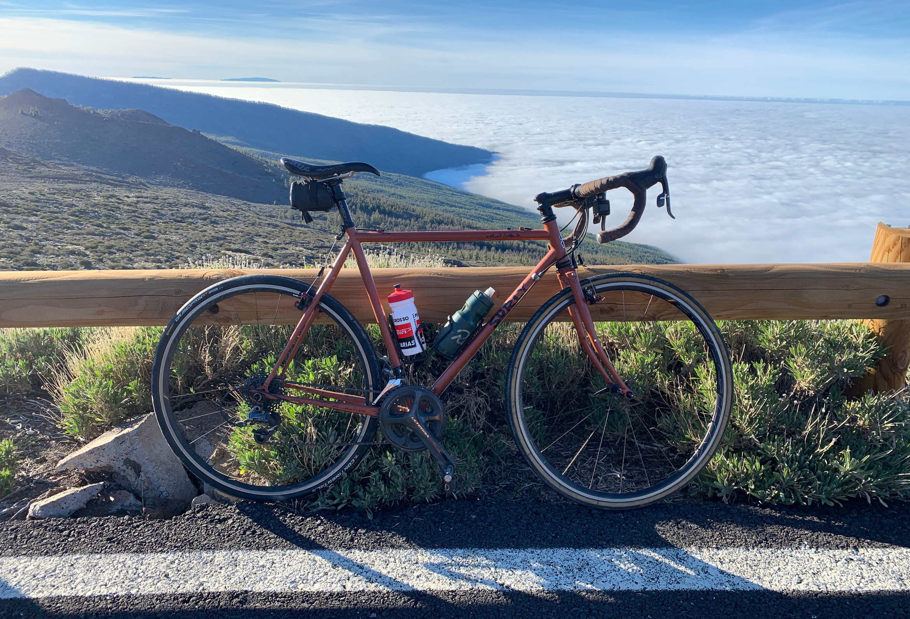
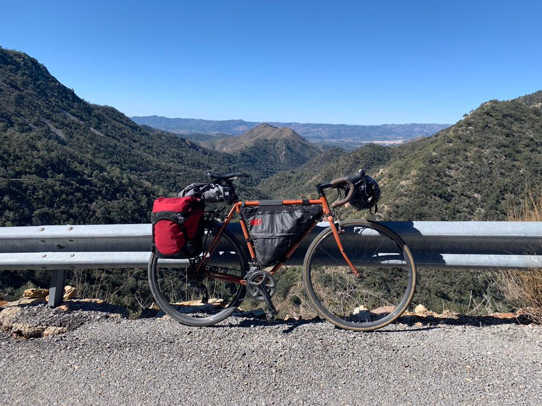

In the middle of 2018 in NYC I was going through some rough burnout. I’d been working my ass off working at a corporation I’d panicked into after two startups prior had gone bankrupt. I was refactoring a huge API ecosystem that was a house of cards, built on sand, made out of soft cheese, yet also somehow constantly on fire, and despite leading efforts to resolve all these problems, I was passed over for promotion several times. What better reason to rage quit your entire life and spend two years cycling through 34 countries, living on my bike, camping on the weekends, crashing on sofas, crossing the Alps and Pyrenees a few times, and even popping down to Morocco for some winter sun! It’s been one hell of a journey, but the bit that surprises a lot of people is that I was working full time, so I’d like to share with you how exactly that worked.

I'll avoid going on about what a shitshow that company was, but I have to a little bit for context. The entire [API ecosystem was a mess](https://phil.tech/2020/prioritizing-api-ecosystem-maturity/). There were all these fun little quirks, like whenever Australia had a busy day, a third-party API would go down, and the entire company would crash, so our customers couldn’t go to the bathroom [which just needed some basic timeouts added](https://apisyouwonthate.com/blog/taking-a-timeout-from-poor-performance). There were mysterious stampeding herds, [method level versioning](https://apisyouwonthate.com/blog/api-versioning-has-no-right-way), and infinite other problems. I didn’t mind the technical trouble, solving this stuff is what I'm good at, and it gave me a lot of blog posts to write over the time. We invented an [API Specification Workflow](https://apisyouwonthate.com/blog/weworks-api-specification-workflow) that has been a north star for others trying to figure out API design-first. It was a constructive time, but the toxic culture, and oblivious management was killing me. I had the respect of most of most of the engineers for my problem solving abilities, but management continued to be willfully oblivious, passing me over for promotion time and time again. A relationship also blew up horribly, and they were somebody I was hoping to propose to. Oh and they just so happened to work at that same company so I would see them every day. It was rough time.

I spent summer and autumn living outside of the city trying to relax, but by winter things were still getting worse, and I was a hair trigger. First week back in January 2019 I was trying to be positive, but one snotty email from my manager and I told them exactly where to go. I spent a few weeks saying my goodbyes to everyone in the USA because my visa meant I had 30 days to get the fuck out. I sold everything I owned, donated a _lot_ of tools and parts to the local bike shop, then got on the cheapest flight I could find. I wanted to go somewhere and be a hermit for a while, at least until I felt like a rational functioning human again. One-way to the Canary Islands for $180? Oh hell yes!

I stayed in a few different parts of the islands, the quieter bits. Every day I would start off by walking out the front door, pointing my bike up a 20% hill, and climbing at least 1,000-2,000 meters of elevation. One day I climbed 4,000 meters! I’d spend a few hours (or maybe most of the day) going up, and up, and up. When I hit the top I’d spin the bike around, and within seconds I was hurtling towards a 180 degree switchback at  40mph! Grit those teeth, hope for the best, and _leeeean_ into the turns! 

It was the most fun I’d ever had, [Juozas Kaziukėnas](https://twitter.com/juokaz) even came to ride with me for a few days, but after 5 weeks I was _still_ burned out. I could be looking at the most beautiful views of mountains and oceans, literal paradise, and in the back of my head I was still arguing with my manager. I planned to take more time to recover before looking for work, but I got talking to [Stoplight](https://stoplight.io) who needed help with their [new suite of OpenAPI-powered API Design tools](https://phil.tech/2019/reinventing-api-design-stoplight-studio/). It was such a perfect fit, and as they had no time to waste I jumped in right away. They didn’t seem to care if I was remote. I think we both thought I’d move to London eventually, but I was not ready to go home to the UK. Being so angry in London would have been a mess of unhealthy drinking, and at the time it also felt like a failure returning from the US with my tail between my legs. So I just kept cycling.

An overnight ferry got me from the Canary Islands to southern Spain, where I cycled from Huelva to Calpe to hang out with [Hannes Van De Vreken](https://twitter.com/hannesvdvreken). He was on a "winter training camp" (bikes and beers holiday) with some mates, and I combined work and play for a few weeks. When that was up I wasn't ready to get on a train and rush back to the UK, so I figured "Fuck it, I can probably cycle to England!". I bought the only bike rack and pannier in town, and wobbled off north.

My gear was shit, everything was wrong, I didn’t know what I was doing, but it ultimately didn't matter. Everything [evolved over time](https://phil.bike/2019/touring-setups/), and despite a bumpy start with bad panniers falling off of heavy racks on every single bump, it ended up being the best thing I’ve ever done. Anyway, I won't talk too much about bike stuff specificaly in this article - I do that on my [bike blog](https://phil.bike/) - this is about the nomad/work/tech aspect. I covered everything above so you could understand my motivations, and imagine yourself in this situation, as not a bike-tour expert who is now apparently cycling across Europe, and working! 

I know a lot of people want to set off a big adventure, I was stuck putting something like this off for _years_. Starting always seems so hard! "I’ve got an apartment with 9 months left on the lease." "I’ve got a partner." "I’ve got a job." "I’ve got a car to make payments on." One or two of those things can come and go at any point but the other things keep you where you are, but when _everything_ is gone it can be easy to make drastic changes.  I don’t think you need to wait for everything to go _that_ wrong. I wish I’d done it sooner. I could and should have put things in storage and gone off years ago. So hey, if you’re thinking about it, this is what I’ve learned working full-time whilst exploring quite a big chunk of the world.

## Work Schedule

> "When do you work? Morning? Evening? Do you get 8 working hrs a day?" Asks [Christopher Imrie](https://twitter.com/chrisimrie/status/1340256258708955136).

Generally I would cycle about 4 or 5 hours on a work day, and that times would vary depending on where I was and what was going on that week.

If 4 hours sounds like a lot, we could put that into context: the average American commutes 1.5 hours _each way_, and a lot of the time that is by car. 3 hours a day just driving to and from work! Even if your commute is half that, add on time spent going to/from/at the gym, or cycling repetitive loops around the nearest park, and there is more than enough time to get 40-90km with a few panniers and still get your work done. 

I generally sleep about 6-7 hours as I can never go to bed at a reasonable time. I then cycle for 4 hours, so that leaves 13 hours to work, eat, and pop to the nearest castle/lake/beach/bar. I would generally work whilst I eat, so that I had more time for all the other things. 

It can be really hard to not go and do _all_ the things in a city. Spending only 36 hours in Dubrovnik is one regret, but honestly the fact that every day I was cycling past something new, seeing castles I didn’t know existed fly by in the middle of nowhere, was more exciting to me than going through every museum, guided tour, and gift shop along the way. Trying to strike a balance was hard, and I could have slowed my roll, but I can go back there in the future, maybe when I have kids, and we can explore that place up close.

> "Was it "normal" office hours (for your timezone) or did you fit work in around traveling?" Asks [George Buckingham](https://twitter.com/gbuckingham89/status/1340273271271546881)

It depends on the time of year, temperature, geography, how I felt, and what sort of work I had going on. I could choose an "American day" or "European day" depending on what was coming up. Need to ride 80km and get over the Serbian border today? That’ll be a 4pm-10pm working day for me! 

When I started with Stoplight, I was writing a lot of code, so those days were generally a bit more normal. Then I was doing technical planning, with occasional code reviews and team leadership. Seeing as we had one team in Poland and a lot of the management in USA, there was a bit of a bottleneck where a few specific people in the USA were the only ones approving pull requests. Agh! I acted as a go-between between USA leadership and the engineering team in Poland, thanks to the mixture of authority and timezones. With my days starting at 8am when Poland got started, and finishing at 10pm after a good amount of time with the folks in Texas, but everything in between was entirely flexible. 

It sounds a bit rough, but it was pretty hilarious, and I loved being useful. I would be out riding bikes, then hear a ping on Slack, and I would pull over where I was and see what folks needed. There was a 1-5 system which was "1 - whenever you get a minute no bother" and "5 - Get your laptop out on the side of a highway and solve this problem" and thankfully 5’s were rare. The primary goal for me was: do not block the European team. So long as they were able to get their work done everything was fine, but if I fucked up and got stuck up a mountain or missed a meeting in a signal deadspot dealing with five flat fucking tyres in a row, I was letting them down, and that must be avoided.

As Team USA and Team Europe were switched from geographic teams to more "pod"-like teams, the communication across the whole company improved. Folks got used to asynchronous communication styles, and I’d also managed to get a lot of the engineers to be more confident reviewing their own PRs. Eventually my go-between position was no longer necessary, and I switched to more product planning work and writing. Neither of those things involve all that much synchronous communication, I just made sure I was around for sprint planning, grooming, and retros, with the engineering team I was product managing, and outside of that hours don’t matter.

During longer summer days I would take my time with breakfast. It became pretty standard to take a laptop to breakfast, and harass the hotel buffer for two hours whilst replacing some of the 4,000 calories I burned the day before. I’d roll back into bed, and await the passing of the impending food coma, whilst trudging through the more mundane emails before checkout, then set of an cycle from 11am. By 4pm it would be dinner time, or time for first or second lunch anyway, which usually went with more work, and more meetings, and hopefully leaving just enough daylight to explore the town at dusk. 

When days were shorter I’d work nocturnally. Get up at 8am, shove my pockets full of boiled eggs and croissants, and smash off to the destination for 2pm before it started getting cold and dark. In winter I’d sometimes stop for long stretches if it was shitty weather, or I had a call pop up, or I lost feeling in my hands. 

Other days, especially when I was pushing through 43°C for a few weeks, battling heat exhaustion every day, I would do hour on, hour off. It was the best. Ride a while, sit in the shade at whatever cafe or petrol station appeared, order coffee and cake, do some work, and back out for another hour of microwave brain. Yes, generally you should try and get riding done early in the day like this, but when you’ve got calls and dinner at 10pm, the sun is up at 7am and it’s an inferno 9:30am-6pm, you don’t have all that much choice but to muddle through.

## Productivity

> "In what ways did doing a 'flow activity' seem to aid original thought? When/where would your best ideas pop into your head?" Asks [@andrew_techfolk](https://twitter.com/andrew_techfolk/status/1340256372630253569)

Regardless of the type of technical work you’re doing, good old fashioned coding, technical planning, product planning, trying to debug some bizarre issue, a giant refactor, whatever it is there’s a good chance you could do with some time away from the keyboard. I think we all know this, but many of us rarely actually do it. We just sit there getting angry and suffering diminishing returns then waste a bunch of time.

Every time I could not think of a solution to a problem, I would jump on the bike and get riding. Sometimes after an hour I’d know what to do, and that’s an hour of work done. I can ride bikes further today yaaaaay!

Sometimes it would take longer, but some roads were monotonous enough I could really get into the right headspace. One time I was trying to plan out a tricky blog post on a super technical topic, and noticed I was cycling down a Spanish motorway. I only notice because a truck nearly took my elbow off. I looked back for the onramp and it was nowhere in sight. How long had I been cycling on the motorway?! Still, after a 2 mile full-speed cycle escape from the motorway, I got back to thinking, and not long later the problem was solved. 

## Employer

> "How was your employer - much persuasion needed?" Asks [George Buckingham](https://twitter.com/gbuckingham89/status/1340273271271546881)

I was really lucky here. Whilst we initially talked about me probably being based in London, New York, or at the main office in Austin, Texas, it was never written down or stated as a hard requirement. For the first year I was waiting for a H1B visa to come through, and it never did thanks to COVID-19 v1.0 closing the US Embassy, and then Trump’s visa ban. 

**Side note:** I specifically asked for a H1B over an O1 because of the whole "If you quit/lose this job you have to leave the country and go find a new one" situation that had fucked me over several times before.)

The initial plan was completely forgotten, and now when my boss or team mates get on a call they just ask "Which country are you in now?" and I point the camera at a Swiss Alp, the Adriatic Sea, or a fjord, and they say "Oh cool!" and we get on with our call.

These days remote work is getting a lot more popular. In 2010-2020 the US went from roughly 1% to 2% remote working, and now we’re up to about a third, so I would hope to see that stick around in the future. Even if companies are not entirely remote, they have had almost a year to figure out how Zoom works, and the benefits to the [environmental benefits are enormous](https://phil.tech/2020/remote-working-climate/). 

> "Were there pain points interfacing with a non-nomad company (e.g.: payslips, addresses)?" Asks [Christopher Imrie](https://twitter.com/chrisimrie/status/1340256258708955136)

None at all. and they send money to my [TransferWise Borderless](https://transferwise.com/invite/u/philips95)* which means they can send a simple US bank transfer without having to work out international payments, but I could access it wherever I was, or send it off to UK Monzo (which is about to kick me off as I am not a UK taxpayer) or now [bunq](https://www.bunq.com/) (as I am becoming a Dutch taxpayer for 2021). 

<small>* This is a referral link, I donate referral bonuses to my reforestation charity <a href="https://protect.earth/" target="_blank">Protect Earth</a>.</small>

As I was a US taxpayer for several years, I am good to work for a US company, but seeing as I was waiting for a visa it made sense for me to be a contractor. That means my employer is not really an employer, they are one of several clients I have as a self-employed person, along with [APIs You Won’t Hate LLC](https://apisyouwonthate.com/), and other independent income like consulting, and royalties.

## Electronics

**Laptop:** Macbook Pro 13", bought it in Spain when I got the job. I’ve had a Spanish keyboard and thank god I don’t write code much anymore, every bracket, parentheses, or symbol of any sort is hiding somewhere bizarre and it fucks me up every day.

**Phone:** iPhone XR. I’ve got a [Pela biodegradable case](https://pelacase.com/) on it, and a tempered glass protector. I’ve bounced that phone off a bunch of rocks and cracked several glass protectors, some of them several times, but I’ve not broken the phone. 

**Battery Pack:** [Zendure X5](https://zendure.com/products/x5-pocket-sized-portable-charger-for-laptops-black). Their website is terrible and it might take you several months to get it, if at all, but when you have this device it’s a game changer. It outputs 45w and supports USB-C PD! That means it can not only charge your iPhone quickly, but it can charge a Macbook Pro! Being able to extend the laptop battery with a whopping 15,000mAh meant I could spend a whole day working from a picnic bench on the edge of a Swedish lake, without having to worry about the battery cutting off.

**Other Power:** Some folks like solar panels when they tour, and absolutely, Anker make some great ones that can charge a battery pack up and keep you juiced, but I never got into that. I was trying to stay as minimalist as I could, so I threw a bit of money into getting a dynamo hub. I got the Cinq5 Plug Power Plus, and a Son-28 Deluxe dynamo built into the front wheel. [I reviewed the Cinq5](https://www.youtube.com/watch?v=EdQUtzKdebY) because… well It has only been working 50% of the time, but man during that 50% I felt unstoppable! I would charge my battery pack, bike computer, phone, portable speaker, and headtorch. By focusing on getting things charged in the right order, and with the help of the battery pack, I could go for days without stopping to charge anything, which made wild camping a lot more pleasant.

**Cables:** Nomad make a [USB-C to Universal](https://nomadgoods.com/collections/cables-universal) cable which is pretty great. I could plug that into the Cinq5 which was USB-C, then charge almost anything without needing to swap things around, even the laptop when I was off the bike. I’d like to get one with a lighting attachment, but at some point I’ll probably do something silly with zip ties and a glue-gun. I’d also carry a spare 10cm USB-C cable, which is ultralight but a good backup in case my main USB-C cable died. I’d also have a regular iPhone cable, one in the frame of the bike, and another in my "go bag" so I could always charge my phone. With the phone I could do a lot of work, its backup navigation, and the best way to find help, so I had to make sure that was always fine.

**Headphones:** I had some bluetooth wired headphones with a terrible mic, and the Polish crew told me in no uncertain terms that I needed to upgrade my mic. I decided to invest in the Gen 2 AirPods, and they’ve been a game changer. I can cycle along on a windy day having a crystal clear conversation and still hear if a car is trying to murder me. No need to upgrade to AirPod Pro as far as I’m concerned, even if I lose/wash one of them again I’d rather just replace that earbud instead. A wired pair of backup headphones is handy for when all batteries are dead, but with the AirPods I always had one or both, for music, calls, whatever, thanks to the charging case and their ability to listen with one while the other charges.

https://www.youtube.com/watch?v=4Lgpi0o0c1Y

## Mail and Shipping

My US mailbox is handled by [Travelling Mailbox](https://travelingmailbox.com/), which looks rubbish but is genuinely amazing. They will scan, shred, or forward letters and packages to wherever you want. I’ve never had a problem with them in over two years. 

I wrote about [logistics of shipping things when you don’t live anywhere](https://phil.bike/2019/touring-logistics/). It’s not always easy but you get the hang of it.

## Hygiene

> "Longest number of days without a shower?" Asks [@andrew_techfolk](https://twitter.com/andrew_techfolk/status/1340255256610009088)

After camping all weekend, Mondays would usually be a little ripe. I was getting in rivers and the sea a fair bit in Spring and Summer so not too bad. I also had a stinky week in Morocco, staying in little huts and not bothering to waste their water.

> "What are your laundry protocols?" Asks [Duncain Porter](https://twitter.com/weg_uk/status/1340254202308800514) possibly posting from the wrong account.

Spandex gets rinsed every day when it’s warm, and every other day when it’s cool. Spandex and most other regualr human clothes can take a long time to dry, but the bike is a pretty good washing line. Tie wet socks, pants, even trousers onto your panniers and dry get cycling. The wind and sun should dry them out pretty quickly, and I only ever lost one hankerchief that way.

A lot of clothes are merino wool, which is fancy and expensive, but for a reason. It has natural anti-bacterial properties, meaning it takes a lot to get it to stink. You can wear merino underwear and t-shirts for days, using them as casual clothes to work in, or even using the t-shirts as base layers. They'll wick moisture when its hot, dry quickly if you sweat or after a rain, and when it's time for a wash it's just a case of rinsing it in the sink. Boom. It won't smell, and by the time you wake up it will be dry.

Every few weeks I’d make sure my rest day was in an AirBnB, or a mates house, and get everything in the washing machine. The longest between washing machines was about a month, and… well nobody _told me_ it was a problem...

## Mental Health

I started writing this talking about burnout, and after two years I do honestly feel a lot better. I occasionally catch myself getting really angry about shit that happened 2016-2018, but then I had a revelation.

https://twitter.com/philsturgeon/status/1119939964333121538

I genuinely meant every word. I’ve since ridden 200km in three days with a busted achilles tendon and even as I limped my bike through hilly farm country heading to Stockholm to recover, I was laughing and genuinely happy. Burnout and depression should not be glorified, but when you’ve been cut down to nothing for so long, it moves the bar on what fucks you up the next time.

Over the last two years I’ve suffered heat stroke twice, hypothermia, hyponatremia twice, two separate flea infestations, three crashes (one so bad I broke my handlebars), a busted achilles tendon, [bodged through countless mechanical issues](https://phil.bike/2020/hacks/), been chased by wild dogs, accosted by an Albanian man who was trying to fuck me at a campsite, been woken up at a wild camp spot by a man holding a shotgun, escaped a mugging in Morocco, and midnight escaped a crazy French man who’d offered me a place to stay, but then got angry when I ran away once I realized he bought me an old toothless hooker - complete with bouncer waiting outside the apartment door. Excusez-moi! 

Every time I was just fucking laughing. Not always in the exact moment, I’m not pretending I’m suddenly the bravest person in the world, but once I am out of immediate danger and thinking back to how I used to feel, the current thing always pales in comparison to how I used to feel carrying all that rage. Even knowing about all this crazy stuff happening, I would pick this over sticking around and letting people walk all over me.

Loneliness however can be an issue. Every few months I would occasionally bump into another bike tourer and occasionally we’d ride for a few hours, get some lunch, trade stories, and trade spares, but that did not happen too often. Thankfully as a software engineer, the world is full of us! I I swung by a few meetups, speaking at the API Barcelona Meetup, API Days in Zurich, and API Days in Paris, met some PHP friends like [Jordi Boggiano](https://twitter.com/seldaek) in Zurich, made some new friends like [Mohamed Benhida](https://twitter.com/simo_benhida) in Marrakesch. Anyone who reached out offering to meet up, I would take them up on it if I was able to get there, and it was always amazing. Sometimes I would get a tour of the area, a sofa, dinner, maybe even a dog to play with, then I’d wander off happy into the nothing.  Between those amazing interactions there could be 3 or 4 weeks where the longest interpersonal connection I would have with anyone was a slightly chatty hotel receptionist, and even then that was only if we had any overlap in language. 

East Europe was the most beautiful, but some of the least chatty, with second languages for them mostly being German or Russian. Niet! Even then, a Bosnian truck-driver would appear out of nowhere to buy me a lemonade and chat about how much he loved going to the UK to deliver things a few years ago, which suddenly becomes a discussion about life, the universe, and everything. Most people in this world are fucking awesome.

This trip is by no means over, but it has changed. During COVID the loneliness only gets worse, and the chances to stay places is massively diminished. I am going to be spending most of this winter planting trees with Protect Earth, as we've got about 6,700 to plant in January and February. That should mean my time will be pretty focused on that, and by the time it's done maybe COVID has fucked off enough that I can organize a group trip with some folks who want to try full-time bike nomading, even if only for a few weeks. If that’s you, get in touch.

## This is a big topic!

There’s loads more I could talk about. I actually dated somebody for about a year during this trip. I went Flight Free for 2020 ([and will be carrying that on for 20201](https://flightfree.world/))as seeing what I've seen has [made me realize how fucked the climate crisis is](https://ecologi.com/articles/climate-emergency/climate-change-by-bike), and how pointless flying is [when there are trains, buseses, ferries, and bikes](https://ecologi.com/articles/climate-emergency/flight-free-holidays-a-practical-guide). I spent a lot of this time fundraising to [plant 100,000 trees in Madagascar](https://ecologi.com/philsturgeon). After cycling home from Morocco I spent 3 months living on a farm, trapped there in the first COVID lockdown. I was taught to live off the land, hunt, shoot, processs fish, pigeon, pheasant, squirrel, and this farm has become the first planting partner for a reforestation charity I started a few months ago, and we are starting to plant trees all over the UK! A lot has happened in this weird and wonderful adventure, but this is a shitload of words already.

There’s other things to talk about like how accessible this lifestyle is to women, how much does it all cost, and all sorts of other crazy stories from the road. Some of it is covered on [Phil.Bike](https://phil.bike), and some of it will be posted there soon. I’ll probably wrap it all up into a book soon, so if that sounds like something you’d read please [subscribe for updates on LeanPub](https://leanpub.com/full-time-bike-nomad), and shout if you can think of a good name for all this. 

Stay safe, and if you can’t do that have fun, but never let burnout turn you into a shitty version of yourself. Take time for yourself, and if you need any help, tips, or advice on any of this, I am here to chat: hey@phil.bike.

_Follow [@philsturgeon](https://twitter.com/philsturgeon) on Twitter for a firehose of bikes, tech, and climate action. Also, for more information about working from the road, listen to [Parallel Passion: Episode 34](https://www.parallelpassion.com/34)._
