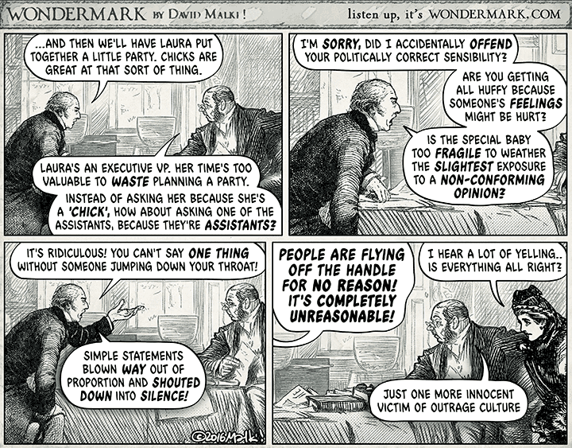
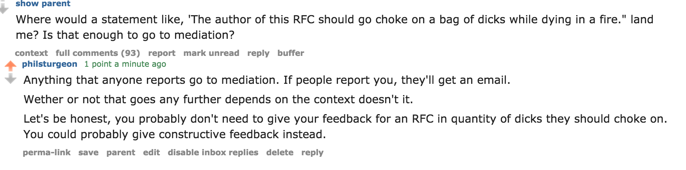

The other week I wrote an article called [Why is Everyone Outraged?](/2016/01/27/why-is-everyone-outraged/), where I explained how the media often manufactures outrage, making it seem worse out there than it really is. This outrage narrative leads some people to think the world is being taken over by evil SJWs, whilst that is generally not at all the case.

Basically I called for people to consider thinking objectively about different topics, and to stop shouting "No it's fine" when people talk about problems they don't understand. I also warned about the dangers of using phrases like "Some people are just spring-loaded to offended." to just dismiss anything and everything that you don't personally see as an issue.

Unfortunately, /r/php flipped out. Not everyone sure, but the few people you expect, and quite a few more. Some were even using anonymous accounts to troll even harder, saying they felt unsafe to comment with their normal accounts because of the "evil SJWs".

One thread on the topic got to about 500 comments before I peaced out. Some of the 500 comments were just arbitrary insults, like calling me a fervent masturbator in desperate need of attention, some played the "No _you're_ the sexist" card, and obviously [Godwin's Law](https://wikipedia.org/wiki/Godwin's_law) was cranked up to 11 almost immediately.

Most of the other comments were about the PHP Code of Conduct RFC. Sure, I was addressing a common silencing tactic that pops up when people try to talk about a CoC, but it seemed strange to discuss the CoC in depth, whilst not addressing anything in the actual article.

Their comments made it rather clear they'd not read the PHP CoC RFC, or were maybe even choosing to be ignorant about what it said. I couldn't tell you which, but the amount of FUD in there was amazingly strong.

The level of weird was pretty high too:

I ended up re-blocking Reddit in my /etc/hosts file and getting on with a lovely week in Colombia with my friends. When I got home we ended up recording a [PHP Town Hall](http://phptownhall.com/) on the topic of Code of Conducts in general, and RE PHP, with user-group and meet-up organizer [Jenny Wong](https://twitter.com/miss_jwo).

> We cover a few things, from the intent of a Code of Conduct, explain it's reach is not as scary as many seem to think, outline a few things that a Code of Conduct does not try to do, and talk about some of the problems minorities have at conferences and online which could be simplified over time with a useful CoC.

> This is one of our best episodes yet. Even if you hate Phil and think he's turned into some sort of social justice warrior white knighting whatever, listen to this and see if the conversation is starting to make more sense to you.

> The goal here is to open a few minds, and bring people to the table so a useful conversation can be had, instead of the usual reaction to Code of Conducts which is immediate screaming into the keyboard, mashing out wall-o-text's about freedom of speech, and assuming people are only interested in inclusivity to impress women...

> We can make our community a better place, and Jenny has a few tips on how you can help with that goal.

<iframe width="640" height="480" src="https://www.youtube.com/embed/HTeIi8dLGMU" frameborder="0" allowfullscreen></iframe>

[Give that a listen](https://phptownhall.com/episode-48-code-of-conduct/). Maybe it can help a few people realize they are using baseless paranoia as a reason to fight against solutions to problems that minorities are continuously pointing out. Maybe it'll bring a few people back to the table.

It'll definitely get me shouted at again. Luckily, I'm used to it. :)

I still need to write about "Code of Conduct FUD" and "Why Opalgate is Not a Good Anti-CoC Defense".
