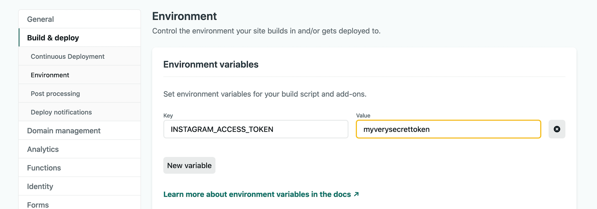

I use [gatsby-remark-oembed](https://github.com/raae/gatsby-remark-oembed) by [Benedicte Raae](https://www.raae.codes/), because it makes embedding Tweets, Instagram posts, YouTube videos, etc in [Phil.Tech](https://phil.tech/) and [Phil.Bike](https://phil.bike) as simple as pasting in the URL.

```
If it's hot, sit under a tree. If it's cold, put your jacket on. If it's raining, keep riding until you find somewhere dry. No air conditioning required!

https://www.instagram.com/p/B5SYlkZFTBY

If that seems terrible to you, there's some way more mainstream approaches to getting work done on the road.
```

It does this by leveraging [oEmbed](https://oembed.com/), a brilliant format for allowing pages to embed a representation of their page on other sites. Instead of having to go click around to find the button that says "Embed with HTML" or whatever, and then shove all that sprawling HTML into your blog post, you can let the robots do that for you.

Unsurprisingly, Facebook have decided to move quickly and break everything again, ruining something good so that they can force more people to make accounts and jump through pointless hoops.

Facebook have made a new [Instagram oEmbed API](https://developers.facebook.com/docs/instagram/oembed), which replaces the [Instagram oEmbed Legacy API](https://developers.facebook.com/docs/instagram/oembed-legacy), which was supposed to be working for a while longer yet.

> The endpoints documented on this page will be deprecated on October 24, 2020 and return an error code 400. Please use the new Instagram oEmbed endpoint instead; they provide the same functionality. To simulate this change and see how it affects your app, include the breaking_change=oembed query string parameter in your request.

Returning 400 for something doesn't sound like "deprecating" something, that sounds like completely bricking it. They've also entirely lied about the date they're bricking the old APIs, with 400 errors showing up for last week or two, with today being October 15th, not October 24th...

It still works when you approach it directly via curl:

```
$ curl https://api.instagram.com/oembed/\?url\=https://www.instagram.com/p/B5SYlkZFTBY
{"version": "1.0", "title": "My photo title is here...
```

But using the gatsby-remark-oembed plugin, which has worked consistently for bloody ages, is now getting 400 errors.

> gatsby-remark-oembed: Error embedding https://www.instagram.com/p/B5SYlkZFTBY Request failed with status code 400

The author of this plugin suggested we try changing the URL, which isn't something anyone should have to do if Facebook were deprecating and replacing things properly, but ok I'll give it a go!

```js
// gatsby-config.js

{
  resolve: `@raae/gatsby-remark-oembed`,
  options: {
    providers: {
      include: [
        'Twitter',
        'Instagram',
        'YouTube',
        'Vimeo',
      ],
      settings: {
        Instagram: {
          url: "https://api.instagram.com/oembed/"
        }
      },
    },
  },
}
```

No joy there. It's still borked.

After loads of mucking around, I accepted that if I want to have any Instagram videos in any of my posts, I'd have jump through all the hoops that Facebook were demanding I jump through in order to use their access restricted API. This new oEmbed API requires [an access token](https://developers.facebook.com/docs/instagram-basic-display-api/overview#user-token-generator) for oEmbed (which is fundamentally breaking the concept of oEmbed), and frustratingly that requires you make a Facebook account, a Facebook Developer account, a Facebook Application. 

To re-enable an old Not-Actually-Me Facebook developer account I had, it of course needed a photo ID to be uploaded, but I had an invalid passport sat in my pocket that they can't do anything interesting with, so whatever. Did that, waited a week for them to verify it, now I'm able to log in. I repurposed a Facebook Application from a company that went bankrupt ages ago to skip a bunch of verification, and now I can have videos from Instagram on my bike blog. What a fuckaround.

To make the gatsby-remark-oembed work, I grabbed an [App Access Token](https://developers.facebook.com/docs/facebook-login/access-tokens/#apptokens) via the command line using my Facebook App credentials.

```
curl -X GET "https://graph.facebook.com/oauth/access_token?client_id={app-id}&client_secret={app-secret}&grant_type=client_credentials"
```

Then I shoved that token directly into the config for gatsby-remark-oembed in `gatsby-config.js` to see if it worked.

```js
settings: {
  Instagram: {
    access_token: 'myverysecrettoken',
  },
},
```

Success! Ok, now to get that into a environment variable! Following the [Gatsby Environment Variable documentation](https://www.gatsbyjs.com/docs/environment-variables/) I did an `npm install dotenv`, created a `.env.development` file, and shoved the token in as: 

```
INSTAGRAM_ACCESS_TOKEN=myverysecrettoken
```

Then the config could be updated to:

```js
settings: {
  Instagram: {
    access_token: process.env.INSTAGRAM_ACCESS_TOKEN,
  },
},
```

In order to make that work, don't forget to add this to the top of the `gatsby-config.js`.

```js
require('dotenv').config();
```

To get that environment variable up into Netlify so it'll build in production not just on my laptop, I shoved the `INSTAGRAM_ACCESS_TOKEN` into their Environment interface.



I'll of course be finding an alternative approach over time, because this is nonsense. At the time I just wanted to publish an article about [cycling around Morocco](https://phil.bike/2020/tagging-along-atlas-mountain-race/), not set up a brand new video streaming solution for a smattering of silly video clips.

Anyway, it's nice to get my hands dirty with some technical stuff after spending the last few months focused on product planning for some new API design tools at [Stoplight](https://stoplight.io/), but this is not the sort of shit people should need to do.

Don't randomly break peoples APIs! Deprecations involve warning people _first_, and [phasing things out](https://phil.tech/2018/api-evolution-for-rest-http-apis/). It doesn't mean saying you'll break shit in a month only to break shit in a week instead. And don't add access tokens to oEmbed. If you're having a rough time handling the load just add a CDN to it or something: I cannot understand the motivation for making this so complex.
