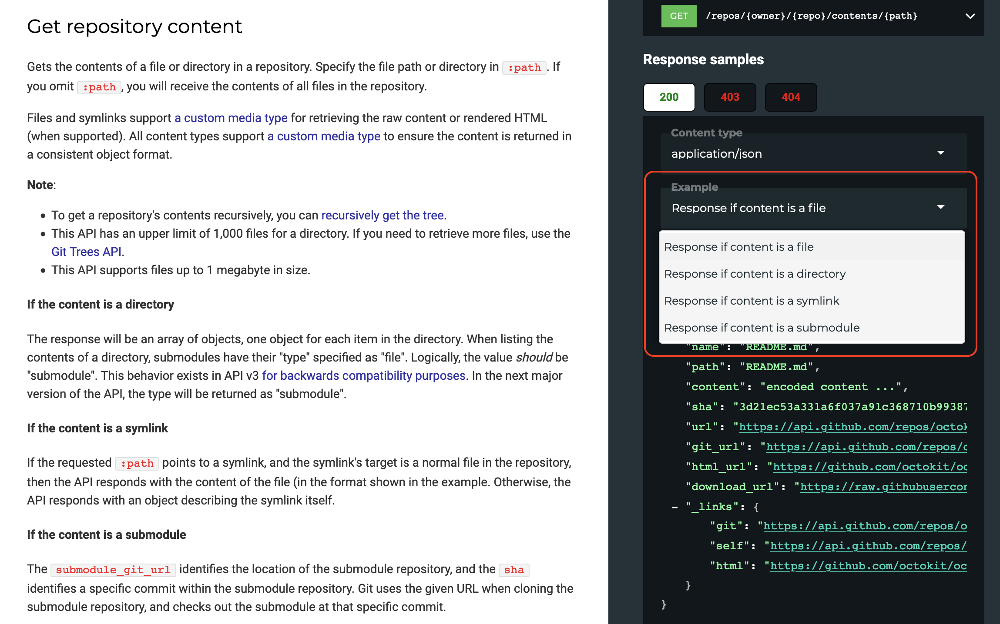

[OpenAPI](https://openapis.org/) has come a long way since its nascent days as Swagger. It's got
[excellent tooling](https://openapi.tools/), is talked about at all the conferences, is used by governments, major banks, healthcare providers, [GitHub](https://github.blog/2020-07-27-introducing-githubs-openapi-description/), [Stripe](https://github.com/stripe/openapi), all sorts. Everyone is using it to bring
the benefits of a type system to the world of REST, which for years too many people confused with rando-JSON-over-HTTP. That said there's still a few quirks left to work out, one example being examples.

The [OpenAPI v3.0 Specification](http://spec.openapis.org/oas/v3.0.3.html) is rather brief on information about how to add
examples, with a few references to various types of [Example
Object](http://spec.openapis.org/oas/v3.0.3.html#example-object) in several
parts of the document. As a user of OpenAPI I was a bit confused for a while
trying to learn how to add examples, as this [tutorial from
SmartBear](https://swagger.io/docs/specification/adding-examples/) only made it
somewhat more clear.

There are examples in Schema Objects, Parameters, and Media Type Objects
(Requests and Responses). Sometimes there is an example, sometimes there are
examples, and these look different too each other depending on where they are.
OpenAPI v2 (OAS2) and OpenAPI v3 (OAS3) handle examples differently: OAS2 is missing
some types, OAS3 has added new ways and in some paces kept the old ways,
and changed the ways some things were done in OAS2. 😳

My time working on tooling at [Stoplight](https://stoplight.io/), and contributing to OpenAPI itself, has only made this confusing problem more
apparent. 

## Media Type

Adding examples to the OAS3 [Media Type
Object](https://github.com/OAI/OpenAPI-Specification/blob/master/versions/3.0.3.md#mediaTypeObject)
allows you to create an entire request or response example. You could show a few
different types of success, and if you support polymorphism you could create a
Cat and a Dog with different cat or dog related properties. 

There are two keywords to create examples for Media Types: `example` or
`examples`. There is more than just an `s` difference between these keywords,
they're different shapes too. `example` is singular example which just contains
the actual example value.

```yaml
# OpenAPI v3 

responses:
  "200":
    description: OK
    content:
      application/json:
        example:
          id: 1
          name: get food
          completed: false
        schema:
          properties:
            id:
              type: integer
            name:
              type: string
            completed:
              type: boolean
            completed_at:
              type: string
              format: date-time
              nullable: true
          required:
            - id
            - name
            - completed
```

`examples` is an array of objects, which have an arbitrary string which acts as a nickname for that example, 
and that property is another object which contains several optional properties including a
`value` property, which then contains the actual example.

```yaml
# OpenAPI v3.0

responses:
  "200":
    content:
      application/json:
        examples:
          Incomplete Task:
            value:
              id: 1
              name: get food
              completed: false
          Complete Task:
            value:
              id: 2
              name: get cider
              completed: true
              completed_at: 2020-08-23T13:22:52.685Z
        schema:
          properties:
            id:
              type: integer
            name:
              type: string
            completed:
              type: boolean
            completed_at:
              type: string
              format: date-time
              nullable: true
          required:
            - id
            - name
            - completed
```

In OAS3, the example names like "Incomplete Task" or "Complete Task" are arbitrary, and most documentation tooling will show it to help users pick which example they'd like to see.  Github uses it to show various responses when repository contents are requested by path: it could be a file, directory, symlink, or submodule, so they've got different examples for each:

```yaml
# OpenAPI v3.0

responses:
  '200':
    description: response
    content:
      application/vnd.github.v3.object:
        schema:
          "$ref": "#/components/schemas/content-tree"
      application/json:
        schema:
          oneOf:
          - "$ref": "#/components/schemas/content-directory"
          - "$ref": "#/components/schemas/content-file"
          - "$ref": "#/components/schemas/content-symlink"
          - "$ref": "#/components/schemas/content-submodule"
        examples:
          response-if-content-is-a-file:
            "$ref": "#/components/examples/content-file-response-if-content-is-a-file"
          response-if-content-is-a-directory:
            "$ref": "#/components/examples/content-file-response-if-content-is-a-directory"
          response-if-content-is-a-symlink:
            "$ref": "#/components/examples/content-file-response-if-content-is-a-symlink"
          response-if-content-is-a-submodule:
            "$ref": "#/components/examples/content-file-response-if-content-is-a-submodule"
```

This looks a bit like this:

<figure>
  
  <figcaption>Multiple named examples from the GitHub OpenAPI description, showing in <a href="https://redoc.ly/redoc">ReDoc</a>, a free open-source documentation generation tool.</figcaption>
</figure>

Having these two different types of examples which have a rather different shape can be confusing for some people, but it gets even more confusing if you look at OAS2.

```yaml
# OpenAPI v2.0

responses:
  '200':
    description: 'OK'
    schema:
      properties: 
        id:
          type: integer
        name:
          type: string
        completed: 
          type: boolean
        completed_at:
          type: string
          format: date-time
      required:
        - id
        - name
        - completed
    examples:
      application/json:
        id: 2
        name: get cider
        completed: true
        completed_at: 2020-08-23T13:22:52.685Z
```

Despite both using the `examples` keyword, OAS2 and OAS3 differ in how they handle
this keyword, with OAS2 only handling one single example for each mime type the
API is defined as producing/consuming, and with OAS3 allowing multiple examples
with arbitrary names.

Notice that these examples are all defined next to the `schema` keyword, not
inside it. If an example is defined inside the [Schema Object](http://spec.openapis.org/oas/v3.0.3.html#schema-object), there are
completely different rules...

## Schema Examples

The schema object is used in several places in both OAS2 and OAS3: request and
response being the two most common. A schema can have an example for an entire
object, part of an object, or a single specific property inside that object.

```yaml
# OpenAPI v3 

responses:
  "200":
    description: OK
    content:
      application/json:
        schema:
          properties:
            id:
              type: integer
            name:
              type: string
            completed:
              type: boolean
            completed_at:
              type: string
              format: date-time
              nullable: true
          required:
            - id
            - name
            - completed
          example:
            id: 2
            name: get cider
            completed: true
            completed_at: 2020-08-23T13:22:52.685Z
```

This looks pretty similar to a media type example that we looked at further up,
nothing to interesting, other than the fact that its inside the schema object
and not next to it. If you maintain OpenAPI tooling, this will probably trip you
up, so please check your tools support it.

Other than giving examples to an entire schema inside the schema, you can also
create examples for single properties at the property level:

```yaml
responses:
  '200':
    description: 'OK'
    content:
      application/json:
          schema:
              properties: 
              id:
                  type: integer
              name:
                  type: string
                  example: get food
              completed: 
                  type: boolean
                  example: false
              completed_at:
                  type: string
                  format: date-time
                  example: '1955-04-23T13:22:52.685Z'
              required:
              - id
              - name
              - completed
```

OAS2 and OAS3 do at least agree on this logic, but this can be rather confusing
for tooling folks. When you have examples like this, they should be validated
against the schema or property they're an example for.

If documentation is being rendered, start with a media type example for the
relevant mime type - or the first of the relevant examples for that media type
if there are multiple - and if there are none of those start to construct an example from
the property examples with
[openapi-sampler](https://github.com/Redocly/openapi-sampler/) or similar. We use this for generating mock responses in [Prism](https://stoplight.io/open-source/prism) (the HTTP mock server) too.

If you're trying to just write OpenAPI, I generally prefer to use the property
example approach (`example` on each property) whenever there's not something
that could be used as an example already. If a `default` is defined, that'll get
used. If an enum is defined, one of those values will get used. If I would like
to create something more hands on that the examples generated from the schema
properties, I'll define a media type example, especially whenever payloads are
dynamic and complicated, and I want to show specific combinations of fields
instead of eeeeverything.

## Parameter Examples

The [OAS3 Parameter Object](http://spec.openapis.org/oas/v3.0.3.html#parameter-object) describes path parameters, query
parameters, headers, etc. In OAS3 they can have `examples` or an
`example`, or as OAS3 lets Parameter Objects have a schema they can have schema
examples just like we talked about above... **that is _three_ things.**


```yaml
# OpenAPI v3

/params:
  get:
    parameters:
      - name: single-example-good
        description: Valid to its schema
        in: query
        schema: 
          type: string
          enum: [foo, bar]
        example: foo

      - name: single-schema-example-good
        description: Valid to its schema
        in: query
        schema: 
          type: string
          enum: [foo, bar]
          example: foo

      - name: multiple-examples
        description: Some valid to its schema some not
        in: query
        schema: 
          type: string
          enum: [foo, bar]
        examples: 
          the-good:
            value: foo
          the-bad:
            value: 123
          the-ugly:
            value: [an, array]
```

AGH that's a lot of places to check for an example.

OAS2 did not let parameters have an example, at least not officially. The OAS2
specification does not define how parameters can work, but "vendor extensions"
came to the rescue, letting anyone use the `x-example` keyword. Depending on
what tooling you're using it will know what that keyword means, or totally
ignore it.

```yaml
# OpenAPI v2.0
parameters:
  - name: fruit
    description: Short name of the fruit you're trying to find
    in: query
    type: string
    x-example: apple
```

The [OAS2 Parameter Object](http://spec.openapis.org/oas/v2.0.html#parameter-object) does not have the `schema` keyword either, so you don't have to worry about that "third place" like with OAS3. 

## AGH

Yeah. This has been causing confusion over at [Stoplight](https://stoplight.io/)
for a while, and came to a head recently when we tried to make sure
[Spectral](https://stoplight.io/open-source/spectral) is [validating all
examples properly](https://github.com/stoplightio/spectral/pull/1284). We were
mainly supporting Schema Examples, and even then mostly only the property
example approach, but we've put a whole pile of effort into supporting all of
them so that coming versions of Spectral, and the Stoplight Studio, will be able
to let you know if you failed to navigate this minefield successfully. 

OpenAPI v3.1 is also partially solving this problem, and adding some more fuel
to he file, as JSON Schema has it's own `examples` keyword. This multiple
examples keyword has nothing to do with any of the `examples` in OAS2 or OAS3,
and it's just bare array of possible values for a schema or property.

```yaml
schema:
    properties:
        coordinates:
            description: We couldn't pick a format for coordinates so we support
            pretty much all of them.
            examples: 
            - "52.3667° N, 4.8945° E"
            - "52.377956, 4.897070"
            - [52.377956, 4.897070]
            - { lat: 52.377956, lon: 4.897070 }
```

If this was the same as the Media Type or Parameter `examples` keywords, you'd
need to give it a mime type key, or a arbitrary key and nest the value inside
`value`, but its a third totally different type of `examples`...

You can't use this approach in OAS2 or OAS3, but you'll be able to use it in
OpenAPI v3.1 when it is release, because it [solves the JSON Schema divergence](https://apisyouwonthate.com/blog/openapi-v31-and-json-schema-2019-09)
properly now. So yay for full JSON Schema support, but... agh for having _yet
another_ way to handle examples.

If we're going to dig our way out of this mess, we need end users and tooling people to pitch in.

1. Upgrade your OpenAPI descriptions to OpenAPI v3.0 right now, and switch to
more modern OpenAPI tooling if your old tools don't support it. This way we can all hopefully burn Ye Olden OAS2 with fire, and get away from vendor extension hacks.

<iframe width="560" height="315" src="https://www.youtube.com/embed/7cUP50qRyTA"
frameborder="0" allow="accelerometer; autoplay; encrypted-media; gyroscope;
picture-in-picture" allowfullscreen></iframe>

2. Let's simplify OAS3.1 but removing some of these excess example approaches. Maybe deprecating `example` and `examples` from the Parameter Object for OAS3.1, to let the schema example tak over? or maybe remove `example` from everywhere so all that's left is the OpenAPI `examples` and JSON Schema `examples`? 

3. If you maintain tooling please add support for OAS 3.1 whilst it is
still a [Release Candidate](https://github.com/OAI/OpenAPI-Specification/blob/master/versions/3.1.0.md). Start using other OAS 3.1 tooling to make sure it's
working, which will speed up everyone's migration when its final.

4. Eventually OAS2 and OAS3 will be a distant memory and nobody will need to figure this mess out, users or tooling vendors.

If you'd like to mess around with more examples of examples for both OAS2 and OAS3 for any reason, take a look at this [sample repository](https://github.com/philsturgeon/examples-examples). 

If you'd like to never have to think about any of this, download [Stoplight Studio](https://stoplight.io/studio/), or any other [visual OpenAPI editor](https://openapi.tools/#gui-editors) which can abstract these problems away. We spend months figuring all this nonsense out, so you don't have to. 😅
