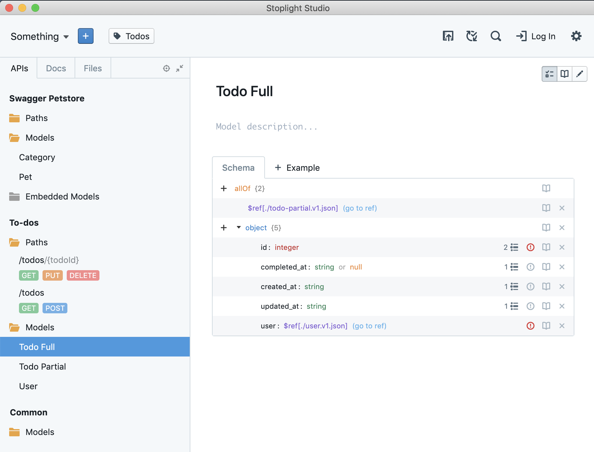

Two months ago I teased that [Stoplight](http://stoplight.io/) was about to release something big, and yesterday we announced [Stoplight Studio](http://stoplight.io/studio) - an OpenAPI and standalone JSON Schema editor, which just so happens to be visually stunning and completely free.

Studio runs as a web app or desktop app, can work with local files and git repos from GitHub, GitLab or BitBucket, and most importantly unlike most of the editors out there it can be used as a text editor or a Graphical User Interface - a shiny visual easy to use form that anyone can be productive with, even if they haven't memorized the OpenAPI specification off by heart!

Not just an editor, Studio has linting and mocking built into it, leveraging our open source projects [Spectral](https://stoplight.io/spectral/) and [Prism](https://stoplight.io/prism/).

This thing is an absolute game changer for API Design, and something I've been waiting for since I found out about it somewhere in 2018. Let me tell you why.

Before joining Stoplight I was working at WeWork. I joined WeWork in 2016 after a friend said "Phil, all of our APIs are terrible, you should come and help us." I could see why, there was no planning process, people just started writing `rails new whatever` mid meeting and they'd all just see where that went. There were ~50 APIs and 80 devs, we were hiring more people and flinging out APIs faster than people could keep up with. None of this stuff ever got documented, so devs were constantly building and maintaining new APIs because they didn't know how the old ones worked. Of course there was no documentation.

Whilst I don't believe anyone seriously tried, the sort of awkward dynamic payload stuff that WeWork had a lot of made it difficult to write docs with API Blueprint - the old king of API description formats. Seeing as many people were unexcited by the concept of docs (despite 20-30% of our development budget going on pointless rewrites which could have been avoided with docs) I was trying to sweeten the deal with other things like mocks and contract testing too.

This [started a multi-month investigation early 2017](https://phil.tech/api/2017/07/20/my-vision-for-a-perfect-world-in-api-specification/) into API description formats and the tooling around it. API Blueprint and RAML soon fell away in the comparison of tooling and functionality. OpenAPI v2.0 was _okay_ when you threw enough hacks and extensions together, so we started using that for a while. We got about 15 APIs onto OpenAPI v2.0, with dedicated developers smashing out all that YAML by hand. Some were happy to learn, many were not happy, and needed a lot of chasing and guidance.

In July 2017 OpenAPI v3.0 was released, and it was _so much better_. It added a lot of missing features like the ability to have nullable properties, and added `oneOf` and `anyOf` along with a lot of other JSON Schema keywords, making it much better at handling our wonky dynamic payloads. The trouble was, a lot of tooling didn't support OpenAPI v3.0 for a while, so whilst [this workflow was coming together](https://phil.tech/api/2018/03/01/api-specification-workflow-matures/) in early 2018 we were still struggling to convince some teams that the benefits outweighed the giant hassle of writing all this YAML by hand.

By [mid 2018 we'd nailed it](https://apisyouwonthate.com/blog/weworks-api-specification-workflow), and by nailed it I mean I spent months duct-taping shit together, powered by hamsters, covering half of the planned workflow. We figured out how the bits we didn't have were gonna work, and some stuff needed to be improved.

The main blocker was that devs were still hand-rolling their own artisanal YAML (or JSON), or not doing it because they didn't want to hand roll YAML or JSON. Some folks were starting to use the other GUI editors out there, most of which were not very good, or only supported creating description documents but then had to be exported and could not be edited. 

Some folks were using annotations and exporting them, using the dreaded "design second" approach, instead of "design first" (which really means not designing anything and missing out on client feedback on new features, leading to useless APIs).

The culture had changed though, from a 80 person engineering team which didn't care about API descriptions at all, to a several hundred person team who really wanted to use all the shiny goodness of the API Design workflow, but were just getting stuff really wrong, and what was created was often inconsistent or not particularly useful due to a lack of understanding of OpenAPI. Workshops and tutoring sessions became pretty regular to try and solve this but with the team growing exponentially that alone was becoming a full time job.

We did have API description documents in our Git repos, powering documentation that was kept up to date, and those descriptions were powering our contract testing and even SDK generation and some other awesome stuff, so when people were Doing Things Properly™️ it was incredibly useful, but the lack of a good editor was still the major blocker.

I got talking to Stoplight bugging them about updating Prism to support OpenAPI v3, and we ended up talking a lot about why I wasn't using Stoplight Designer. I really wanted to, but their lack of OpenAPI v3.0 support, "everything goes via the web interface into our GitLab" approach, and a few other bits of feedback ended up turning into a lot of productive conversations, and those conversations turned into a job! Now I work on guiding the design and development of these tools, to be something I'd have been damn excited to use to solve these problems I spent almost two years muddling through.

Now, after months and months of hard work by the whole team, [Stoplight Studio](https://stoplight.io/studio) is out! 

- Spectral is built right into the editor so folks don't forget to enable it
- Prism is built right into the editor so folks know they can use it
- GitHub, GitLab or BitBucket can be your ACL, no more time wasting adding/removing that freelancer who quickly wants access
- Developers don't need to read the OpenAPI specification
- Technical Writers and other non-developers can work on the API descriptions
- It has built in documentation so there's no need to duct-tape together Amazon S3 deployments
- It allows mixed Markdown (CommonMark) content as well as API Reference Docs, so no need to hack them into Jekyll or some other static site generator for "How To" content
- It works with local files so there is no walled garden to worry about, you can edit with Studio and host docs or mocks somewhere else, doesn't matter
- It's FREE

I could go on. Being able to solve all these problems with a free tool is the best thing, and its by no means the end of the story. Now that we've absolutely nailed API design for the individuals there will be even more focus on teams, collaboration, and sharing/reuse of components like models. That's not even mentioning governance. 😱

Give [Studio](https://stoplight.io/studio) a try. There's a [web version](https://stoplight.io/p/studio) if you don't want to jump straight to downloading stuff, and yes, the web version can git clone!
