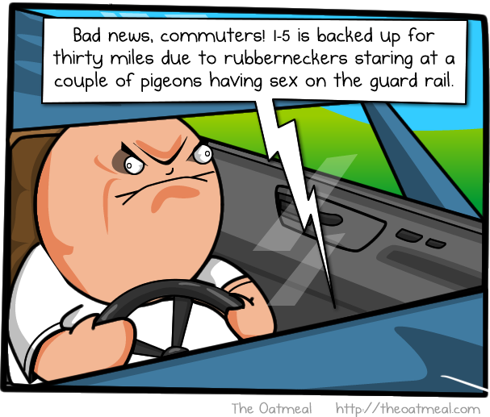
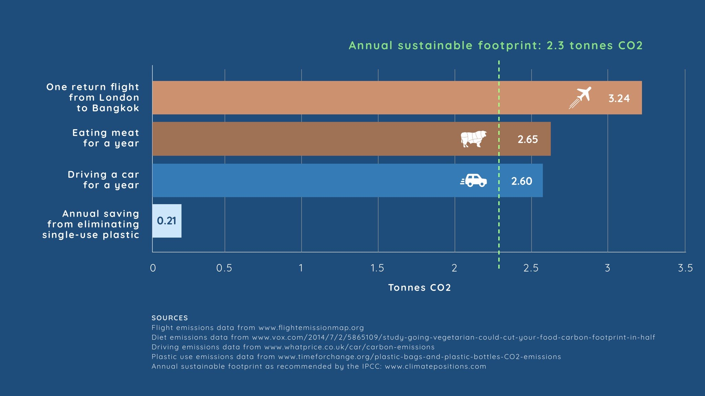
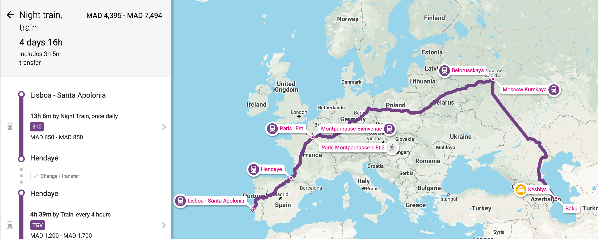
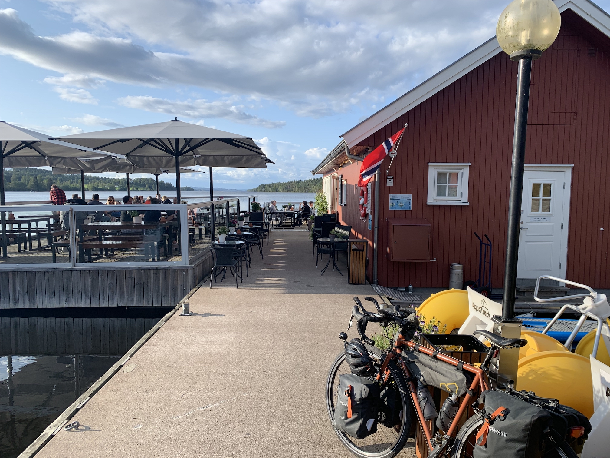

Companies are stepping up to [go carbon neutral](https://www.climateneutral.org/certified-brands) ([or even carbon negative](https://blogs.microsoft.com/blog/2020/01/16/microsoft-will-be-carbon-negative-by-2030/)), and the number of [big companies offering remote work](https://www.forbes.com/sites/alexandratalty/2019/01/15/work-from-home-2019-the-top-100-companies-for-remote-jobs/#d580efe15444) is on the rise, but [remote work in the States is still only 3-5%](https://lp.buffer.com/state-of-remote-work-2020). With most of the world ([especially the U.S.](https://ourworldindata.org/uploads/2019/10/Cumulative-CO2-treemap.png)) desperately needing to sort its carbon footprint out, remote working might just be a big piece of the puzzle.

https://twitter.com/chris_herd/status/1217413669484548096

Not being forced to center your entire life around getting to a specific place every Monday to Friday opens up a lot of opportunities to improve the quality of life, _and_ massively lower your carbon footprint, which improves quality of life for everyone everywhere.

Getting out of the daily grind and riding around all of Europe has given me a chance to think about a lot of things, mainly how [serious the climate crisis is](https://offset.earth/articles/climate-emergency/climate-change-by-bike). This motivated me to [fundraise planting a shitload of trees](https://offset.earth/philsturgeon), and strive to reduce my own carbon footprint as much as possible. All of this freedom, time to think, and ability to reduce my footprint was made possible thanks to [Stoplight](stoplight.io/) supporting remote work, and I'd like to talk about how you can do the same.

## Commuting Sucks

Regardless of the transportation you choose: Car, train, bike, hoverboard; going to the same place every single day is uninteresting at best. 

The average annual carbon footprint is 10 tonnes in many developed countries, and in America it's 15-20 tonnes. The recommended sustainable footprint for a habitable planet is ~2 tonnes, so... fuck! Driving alone is enough to sail straight past that target, meaning if you even breathe at any point in the year you're actively contributing to [150 million peoples homes being underwater by 2050](https://www.globalchange.gov/browse/multimedia/projected-sea-level-rise-and-flooding-2050).

Trains are [better for the environment than flying](https://www.bbc.com/news/science-environment-49349566), the exact improvement of course depending on the power source. With your hands freed up for entertainment or other productive tasks, but going to the same train station every day is not the best. Even if you love cycling, riding the same route every day to and from the same bloody office gets very mundane very quickly. 

The average American commutes for an hour each way to and from work. For example, my mate used to drive from south New Jersey to Brooklyn every day, which is a 1hr drive when traffic is normal. That is 6kg (13lb) of CO2 emissions of each way. That is 240kg (530lb) a _month_, and over 262 working days that's a ridiculous 3,144kg (6,931lb) of CO2 emissions. That is 3.14 tonnes, just to go to the office, 1 tonne over what the entire annual footprint needs to be.

Imagine if more people just... **didn't**. 

If you simply work from home, you can just not do that. If you're a digital nomad, you can also just not do that. Wherever it is you are is somewhere you can work, and if you stick to sustainable transportation methods like electric trains or bikes, you can slash your footprint massively. 

For me, instead of a 1-2 hour each-way hell-commute, I cycle 3-4 hours a day. That usually lets me get 60-80km a day. Sometimes I do the whole ride in the morning, sometimes I work a few hours over breakfast and have one big midday ride, sometimes I do one hour on, one hour off. It all depends on my calendar, the terrain, the weather, and if I'm riding solo, or with company. For best results, I try keep Alp crossings to the weekend. 

## "Looking Your Best" is Unsustainable

There are countless other benefits, even the seemingly irrelevant "less time/money on makeup" has wins. Lots of makeup uses palm oil, which comes from deforesting million of hectares of rainforest, which are usually [habitat for orangutans](https://orangutanfoundation.org.au/palm-oil/). We're losing a football field of rainforest [every bloody second](https://www.bloomberg.com/graphics/climate-change-data-green/) for things like this. Anything that helps reduce demand for palm oil is going to help us breath, and maybe we will still have orangutans in 2025.

This same idea extends to other parts of our appearances, like clothing. The fashion industry [produces 10% of the worlds carbon emissions](https://www.worldbank.org/en/news/feature/2019/09/23/costo-moda-medio-ambiente), and despite peoples best intentions, 85% of clothing donations end up in landfill.

I've never cared about fashion. I used to be mistaken for a bike messenger and get told to use the service entrance at my own office, but now I barely buy clothes at all. I own one pair of trousers, two t-shirts, two pairs of boxers, two pairs of socks, one cold weather cycling top & bottom, one warm weather cycling top & bottom, a few pairs of gloves, and a beanie. That's it. I've learned to repair them, initially just so I didn't have to worry about finding replacements on the road, but now for the environmental benefits too. 

After all, who gives a shit how I look when I'm bike nomading? I get work done on the side of the road, park benches, cafes, wherever I feel like stopping. I'm happy in my Power Ranger costume, and nobody else seems to care.

I love not needing to waste time, money, and energy resources on doing laundry, I just occasionally hand wash the few things I own, and dry them in the sun. Sometimes I lash things onto the rear rack and let them dry while I ride. 

## Un-rushed Vacations

When talking to people about [going flight free](https://offset.earth/articles/climate-emergency/flight-free-holidays-a-practical-guide), the most common response is "but other transportation is so slow, I'll spend my whole vacation getting there!" Understandable. Annual paid leave varies massively all around the world, with New Zealand offering 30 days, and in the U.S. (whilst companies are legally not required to give any) the average is 16 days. 

Remote work solves this problem. Right now I'm on vacation in Morocco. I remote worked my way down to Marrakesh, bike-commuting through Portugal and Spain a little bit each day, and now I'm spending a week offline cycling around the Atlas Mountains. If I was still chained to a desk then getting here flight free would have been rough. London to Marrakesh is 37 hours on public transportation, switching in Paris, Barcelona, and Cordoba. 

The rational part of your brain knows that flying is killing the planet, but other parts of your brain push that aside, telling you that you deserve a break from the stress of normal life, and the budget 5 hour flight seems infinitely more appealing.

The default of flying is ridiculously pervasive, to a point where lots of otherwise well-intentioned people don't even consider the alternatives. I stayed with a lovely couple in Lisbon ([Couchsurfing](https://couchsurfing.com/) ftw!) who were planning a trip to see some family in Azerbaijan. They were intrigued when I told them I was not flying, but they said there was no other way for them to get there. I whipped out [Rome2Rio](https://www.rome2rio.com/) and showed them the alternatives.

They were amazed to see there was a train route the whole way there, but put off when they realized it would take 4.5 days. He commented that it would require vacation time to get there, because it would not fit in a single weekend.

When you're working remote, you don't have to get all the way to wherever you're going in one ice-cap melting jump, you can take your time. I asked if they've ever wanted to go to Paris, Berlin, Warsaw, Moscow, or any of the thousand other places along this train route, and a lightbulb pinged above their heads.

Lisbon to Paris one weekend (night trains!), remote work in Paris for a week, train to Moscow the weekend after, and hang out there a bit... all without using up any vacation time. Or, slow it down even more. One weekend is travel, the next is exploring, and you still get all the time either side of working (where you aren't commuting either!) to check out wherever you are. 

Some folks will call this sort of thing being a "digital slowmad". Remote workers are often concerned to go slowmad because it sounds expensive paying for somewhere to stay when you already have rent/mortgage, but...

## Leaving Home to Work Away

Leaving home for sustained periods of time can start to feel pricey. For example, you're paying rent in one place, but you've gone off on a two month long digital slowmad adventure. If you've got infinite money this is fine, but for the rest of us this is daunting. 

Airbnb is one approach, but it can also be tough to find people looking for longer stays, as many Airbnb stays are just weekends, weeks, or maybe two. You can get a [cleaning service](https://turnoverbnb.com/) to look after the place between short stays, but at this point you're basically running a small business, and in some countries you have the tax complications to go with it.

Another alternative is [Home Exchange](https://www.homeexchange.com/). Through this site you can do direct swaps, so no money changes hands. Or, you can let people stay at your house in return for points which you can use elsewhere. I know folks who will wait for an offer to come in, do the straight swap, then train over there and that's their slowmading sorted, and maybe a vacation too if they love the place. 

This is cheaper than budget package holidays, less shit, and drastically better for the environment.

## Where to Get Work Done?

When I started at Stoplight I was mostly writing code, and reviewing pull requests. Later on I moved to product planning. All of which easy to do asynchronously so it never mattered what timezone I was in. I could chose an "American day" or "European day" depending on what was coming up. Need to ride 80km and get over the Serbian border today? That'll be a 4pm-10pm working day for me! 

The flexibility of remote work (when a company properly understands remote culture in place) means time doesn't matter. When there's a meeting I can just pull the bike over and talk anywhere. After 90 days my U.K. phone service provider Three kicked me off, deciding I was not "on vacation" anymore, but my U.S. Sprint contract continued to work just fine. It was $25 a week extra for unlimited data anywhere, which is pricer than some approaches but I consistently thought this trip was ending "next month" for about a year, so some decisions were not made with full awareness. 

I was getting work done on picnic benches by lakes in Sweden, Slovakian petrol stations, and from my tent. I was calling in from farmers fields, abandoned train stations, the occasional McDonalds, hard shoulders of highways, and once still riding the bike. AirPods are amazingly good at getting rid of background noise and wind somehow. If it's hot, sit under a tree. If it's cold, put your jacket on. If it's raining, keep riding until you find somewhere dry. No air conditioning required!

https://www.instagram.com/p/B5SYlkZFTBY

If that seems terrible to you, there's some way more mainstream approaches to getting work done.

### Mates House

There is one element of working from home which can mess up your carbon footprint: when you're in an office and the house is empty, you've got your heating/cooling turned off (or you bloody well should have). Many people collectively getting benefits from one bigger industrial air conditioning system is likely better than [everyone's house being heated or cooled independently](https://www.bbc.com/worklife/article/20200218-why-working-from-home-might-be-less-sustainable). 

There are a few ways you can reduce the impact here, like improving insulation and natural solutions like [planting shade trees](https://www.arborday.org/trees/climatechange/summershade.cfm), working from a single room and only heating/cooling that, etc.

Another approach is to team up with local remoter workers and share resources. If you've got friends nearby who also work remote, you can take it in turns to all work from their house, cycling over there, or _maybe_ driving around the corner when the weather sucks. Driving around the corner is still giving you a lower footprint than a) driving to the office, and b) heating individual houses. It's also more fun to work with friends. If you don't have any work-from-home friends, you could try meeting folks on [Nomad List](https://nomadlist.com/), or facilitate the liberation of your office-trapped friends. 

This approach is not so handy for people who move around, unless you've got friends spread around where you're going, but there are many other options.

### Coworking Spaces

WeWork is the worst in many ways, and until recently it was impossible to go into one for just a day. Now you can get a monthly membership which lets you rock up at various locations, but their rollout strategy has always been placing 1,000 locations in the same city, whilst ignoring the rest of the country. WeWork is exceptionally bad for climate crisis aware humans, as all the WeWork's I went to as an employee were inexplicably freezing in summer, and boiling in winter. 

There are a million co-working spaces around the world, and not just in megacities. Take a look at [Coworker.com](https://www.coworker.com/) to find spaces, get day passes, or book longer stretches. They recently launched [Global Pass](https://www.coworker.com/global-pass) which lets you buy a bunch of credits to then use all over the world.

### Cafe's & Restaurants

I know I know, there is a huge amount of stigma against the coffeeshop remote worker, with the cliche being that they buy one coffee then sit there all day. This cliche was stuck in my head, and for a while I was getting absolutely wrecked on coffee trying to avoid being that person. It helped me with the cycling, but it's hard to focus on work when you can see through the fabric of time.

When places are rammed, and generally when you're in a big city, most places are going to at some point be a bit stressed with you messing up their income. In Milan they'd tell me to fuck off the second I cracked out the laptop. Then I found [Moleskin Cafe](https://it.moleskine.com/it/moleskine-cafe), and they didn't care at all. [Workfrom](https://workfrom.co/) can help you find more places like this.

Whenever you're not sure, it can help to simply be up front with staff before you sit down.

> Do you mind if I get a coffee and some snacks, and work for a few hours?

I like to ride through touristy areas out of season. Riding through the Swedish countryside I found a beautiful restaurant by a lake, and they had a smattering of guests who all wanted to sit outside. Inside was totally empty, and they helped me find a table next to a power cord. They said they didn't mind how long I stayed, because given the choice of a) getting a few quid and helping somebody, b) literally nothing, they'd rather the former.

### Trains

Whether you're on your way to some compulsory "yeah we're remote but..." company all-hands-summit-retreat, a conference, a vaction, or just off to visit gran, trains are a decent way to get where you're going as far as the environment is concerned. They are usually a pretty great place to work too.

I made some mistakes last year and did more flying for conferences than I was comfortable with, so to limit my contribution to [Greeland pointlessly melting](https://www.washingtonpost.com/climate-environment/2019/12/10/greenland-ice-losses-have-septupled-are-pace-sea-level-worst-case-scenario-scientists-say/) (and fucking [burning](https://nationalpost.com/news/world/as-wildfires-scorch-greenland-its-ice-sheet-is-on-track-for-a-record-melt-season)) I spent three days working on an Amtrak from Seattle to New York. I had both a mobile hotspot and train WiFi the whole way - except for North Dakota 🛢🦗 - and got a few articles written, and a few PRs sent. The only thing distracting me from work was A++ views.

https://www.instagram.com/p/B2H1drxFY3n

The transfer in Chicago meant I got to spend an evening with my mate Zack Kitzmiller, who I'd not seen since we both moved away from New York. I'd not have seen him if I flew directly, and even if I got dumped off at O'Hare, thanks to TSA nonsense I wouldn't have been able to have quite so many beers with him. 🍻

The train from Tangier to Marrakesh down here had awesome views, and I got to review the VS Code extension for [Spectral - the OpenAPI linter](https://stoplight.io/open-source/spectral). Tomorrow I'll take the night train back up to Tangier, meaning I won't be doing any work but I will be combining my hotel and travel costs, time, and footprint. 

### Ferries

Sometimes there is water in the way of where you’re trying to go, but this form of slow travel usually comes with free or cheap WiFi. Make sure you turn off your mobile roaming because many ships offer their own Mobile Network which costs a bloody ridiculous amount. Ferries pretty much all come WiFi at equivilent or better prices than in-flight WiFi, and way better speeds too. The Norweigan ferry handled video calls just fine.

I'm well aware ferries don't seem like envionrmentally modes of transport at face value. Whilst electric ferries have started popping up in [Denmark](https://www.bbc.com/news/business-50233206), [Norway](https://electrek.co/2019/08/21/worlds-largest-electric-ferry/), and [Washington](https://www.greentechmedia.com/articles/read/worlds-second-largest-ferry-operator-switching-from-diesel-to-batteries), the vast majority of ferries are still running on stinking great diesel engines. Still, most ferries are primarily not running for passengers, they just let a few humans onto one of the floors and everything else is for carrying a literal boatload of trucks. Those trucks are going wether 50% more or less passengers come along, and seeing as the average person weighs about as much as one of their spare tyres, the indivudals share of the carbon footprint is almost negligible.

Emissions data from Department for Transport (DfT):

* Ferry foot passenger: 0.02kg CO2e per passenger km
* Ferry car passenger: 0.13kg CO2e per passenger km
* Flights, domestic: 0.3kg CO2e per passenger km

> Every journey is different, but ferry about ten times less polluting [than flying], if travelling by bike. — **Source**: [@FlightFree2020](https://twitter.com/FlightFree2020/status/1213165841753214977)

Getting a days work done while you float over the sea, and you can walk around as much as you like without raising suspicions of an air marshal. If you gotta go somewhere and the train won't handle the wet bits, then taking a ferry is a reasonable choice, and with decent Internet you don't need to take a vacation day for the voyage.

## Finding Remote Jobs

In your next 1:1 why not raise the question of remote working. Explain that you're terrified the world is on track for a 5°C warmup which is drastically worse than the most nilist scientists thought probable, resulting in millions of heat-deaths and worse, and that letting you work from your couch more often seems like an easy win to everyones benefit.

Maybe start off with remote Fridays to see how it goes, then if it goes well it could be a few days a week. Easing into remote working is still a reduction in how much you need to commute, and if things go well more people on more teams could start working from home more often. Maybe the company can downsize their offices, or at least hold off on that expansion they've been dreading.

If your company don't give a shit about your existential concerns then you probably don't want to work there anyway. There are a plethora of sites around for finding remote-friendly companies up remote jobs, so escape the commute with a quick search on any of these.

- [JustRemote](https://justremote.co/)
- [Remote.co](https://remote.co/remote-jobs/)
- [RemoteOK](https://remoteok.io/remote-jobs/)
- [Remotive](https://remotive.io/)
- [Loads more sites](https://skillcrush.com/blog/sites-finding-remote-work/)

For extra bonus points, you can [get a job actively tackling the climate crisis](https://protect.earth/jobs/), many of which are remote. 

## Footprint Tracking

If you ignore everything I've written here and just do one thing, it's grab a carbon footprint calculator, understand your impact, and work on getting it down every month. I've put together a list of [carbon footprint calculators](https://protect.earth/footprint-calculators/), and my favourite so far is [North App](https://north-app.com/) due to its slick UI, and [open-source approach to integrations](https://github.com/tmrowco/northapp-contrib).

Enable TripIt, Uber, fuel trackers, and one of the awesome smart-meter integrations, or simply setup recurring commuting information with distance and engine type. See if you can backfill the data for a few months to get a good idea of your usual footprint, then set out to lower your footprint. If backfilling is not an option, track one month of usual activity as you go, then try and lower it next month.

There are a million ideas for how to do that on [Protect Earth](https://protect.earth/) so pick any of them, but wiping out your commute and air travel is a damn good way to get started. 

## Key Takeaways

- Limit movement as much as possible, remote working 2-3 days a week is a good start for now.
- When movement is required try to bike, train, bus, coach, carpool, or ferry, in that order.
- When vacations are coming use your new found powers of slow travel to work your way towards there, what's the rush.
- Limit the number of rooms and buildings requiring heating.
- Swap homes with people and stay with friends to avoid hotels.
- [Track your footprint](https://north-app.com/) and try to lower it by 10% every month.
- [Offset whatever footprint is left](https://offset.earth/), ideally offset more to make up for that shit mate we all have who doesn't care if we lose the [remaining half of the coral reefs](https://www.bloomberg.com/graphics/2019-coral-reefs-at-risk/?srnd=green).

_For more information about working from the road, listen to [Parallel Passion: Episode 34](https://www.parallelpassion.com/34). If you're interested in the bike tour itself, check out my other blog [phil.bike](https://phil.bike/). Or follow [@philsturgeon](https://twitter.com/philsturgeon) on Twitter for a firehose of both._
