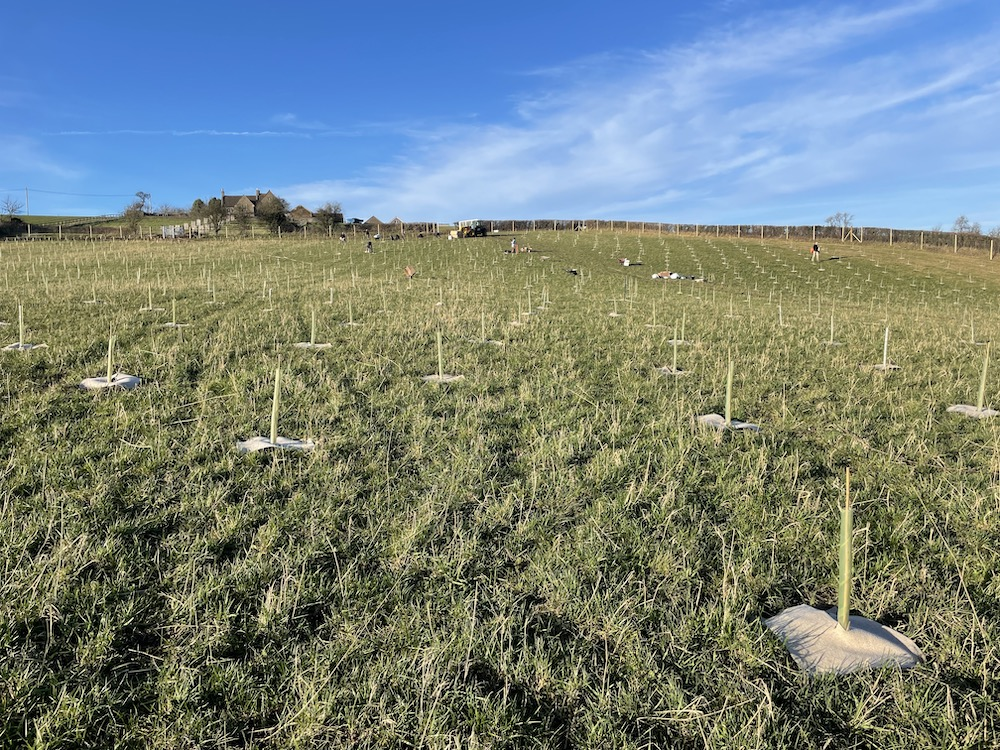
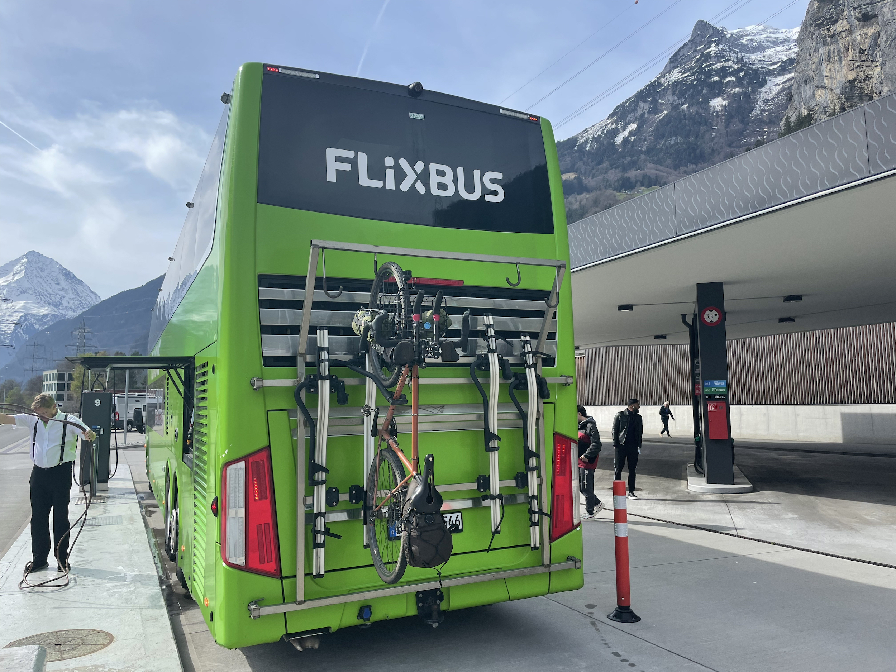
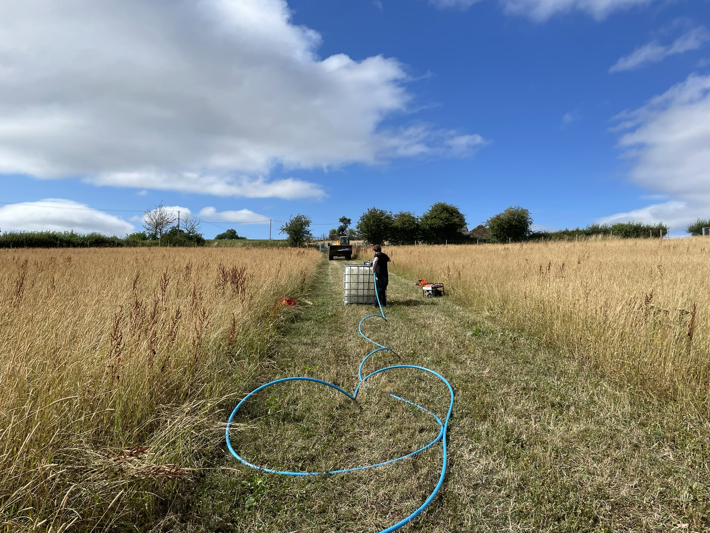
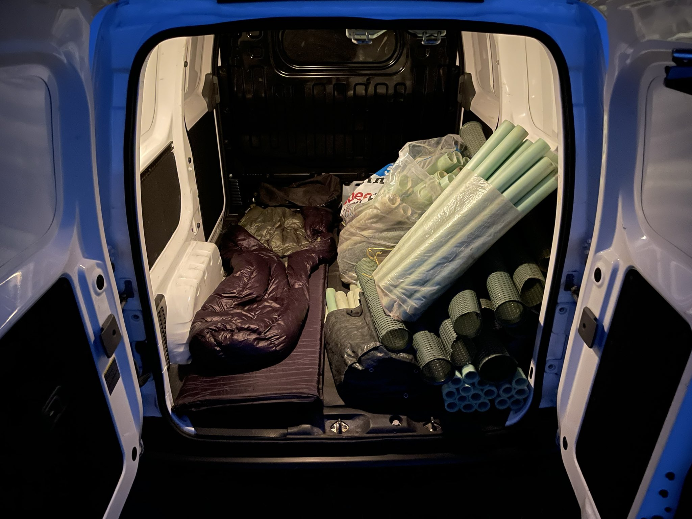

It’s been another weird and wonderful year, and I wanted to reflect on that in a post.

In the last few months of 2021 I quit my full time contract with [Stoplight](https://stoplight.io/), which had been the end of a fantastic run of making the world of API design a better place. We solidified the API design-first workflow through story telling, empowered that approach with fantastic tooling, and released open-source tools so powerful that most of our competitors started using them.

Leaving Stoplight was wild, because its the first time I have chosen to leave a job that I loved. Regardless, there wasn’t much choice. The reforestation charity co-founded in 2022, [Protect Earth](https://protect.earth/), was growing fast. We had an ancient woodland donated to us, I was planting thousands of trees a week with a ragtag crew, and my health was consistently horrendous.

## Garbage Health

At 33 years old I should not have been getting hernias, but I think I’d been using a hooked slasher wrong. Clearing a few miles of bike path so kids in the valleys could ride their bikes had mangled my insides, and I had been out of action for months. Thankfully as a Dutch resident I had the choice of location for hernia surgery. Thanks to the Conservatives constantly knackering and defunding the NHS and mismanaging COVID, the waitlist in the UK would have been over a year, but in the Netherlands it was only three months.

After the surgery I had a few days laying around, then it was straight into tree planting season. Literally got on the Eurostar two days after the surgery and was in a field by the end of the week. This becomes a theme.

## Full-Time Tree Planting 

Without enough staff to plan events and find volunteers we jumping from project to project, with our heads down working so hard with a skeleton crew to plant that project that we'd not have enough time to finalize the plan or find volunteers for the next project. Doing it all throughout named storms and bitter cold didn't help with the pace, or entice many volunteers out. We were being blown sideways up and down west Wales, the Peak District, and the Cotswolds, but a lot of great people put in heroic efforts.

One day we were planting 500 trees in the Cotswolds, next day it’s 5,000 on the outskirts of London for three days, and the day after we’re off to Preston for another 2,000 trees. Absolutely bonkers, and trying to do all this without busting my stitches wasn’t a huge amount of fun. I had to delegate, and rode the directors chair far more than I would have liked. 

Regardless it was done, the 2021/22 planting season saw us plant about 38,000 trees, which is a damn site more than the 4,000 the year before.

## Rescuing an Ancient Woodland 

In April we [completed the acquisition](https://www.protect.earth/blog/high-wood) of a 64 acre ancient woodland in Cornwall, called High Wood near Liskeard. I am still in shock that it happened, and it has been not just a high point of the year but a life changing event. Individual donors big and small chipped in enough that we could buy £440,000 of historic woodland, part of a UNESCO World Heritage site!

Managing this woodland was a lot of work throughout the year. I was meeting multiple ecologists and foresters to get a woodland management plan made up that would maximize wildlife recovering, carbon sequestration, and not leave the charity broke. Without getting too in the weeds the goal is to restore the ancient replanted woodland to the majestic temperate rainforest it would have been before it was gutted to create a timber plantation and repeatedly clearcut. The plan is to remove the non-native conifers slowly and in a specific way, using the timber sales to fund the restoration work, which will mostly be assisted natural regeneration.

I was speaking at the local community centre getting concerned residents on side, meeting the local mountain bikers to make the trails safe, talking to journalists, planting trees, strimming footpaths, giving local councilors the tour, learning how to repair fencing… It was a weird and wonderful time learning new skills.

## Touring down to Italy, racing the Italy Divide

Tree planting goes until March/April at which point the saplings are no longer dormant, and woodland management work like vegetation clearance needs to stop in Spring when the wildlife gets more active and birds start nesting. By that time I was beat and needed a change of pace, so as soon as High Wood work wound down and the last tree was planted I got on my bike, set off to catch up with friends in Amsterdam, then took a bus down to Italy. 

I had meant to be training for the [Italy Divide](https://www.italydivide.it/), a 1,250km off-road endurance cycling event that is one of the hardest bike packing events in Europe. Instead of training for months/years I rolled off the sofa and gave it a punt on a bike made 80% from zip-ties.

Cycling from Milan to Naples was my test. If I can make it down to the starting line before the race then great, and if not then whatever I’ll just have fun randoming around. 

It was beautiful to be back on the bike. I saw amazing views. I met amazing people. I can talk more about that experience on [phil.bike](https://phil.bike/), but the short version is I managed to get down there, and got absolutely destroyed racing the way back! 

A combination of not having good health for so long, not training, and having a bike that just wasn’t up to the task, meant I got about 550km in the first three days then could barely push a pedal. Hammocking off the side of a mountain looking out at the sea hoping I remembered which side to exit the hammock was a hilarious memory, and I cherished the entire experience.

The ass kicking lead to me selling Surly, my trusted companion since [going bike nomad in 2019](https://phil.tech/2020/bike-nomad/). I posted it from Italy to my good friend in Bath at the start of May, expecting my new custom steel bike packing frame to be ready any day now, which unfortunately had been the case for over a year. Still the "coming soon" promises had ramped up, so that didn’t seem unreasonable at the time.

## Fighting Wildfire & Drought

I’ve not lived anywhere since 2019 and this year was no different. I was increasingly finding myself renting vans off [Camplify](https://camplify.co.uk/), [Quirky Campers](https://www.quirkycampers.com/), and [Indie Campers](https://indiecampers.co.uk/). They helped me have somewhere to knock out the occasional bit of consulting to not go entirely broke, and let me carry a lot more equipment.

I’d cycled to the woods from Bristol a few times, but trying to carry a strimmer is impractical, and carrying machetes on the bike has questionable legality. Being able to set up the vans at High Wood or wherever else I was working became pretty addictive. Having all the gear, food, water, even a USB battery powered shower… it was an absolute game-changer for me.

Summer became about fighting the heatwaves. In July I spent my birthday week in High Wood with my head up the ass end of a woodchipper trying to clear a few tonnes of deadwood brash piles, that had been left by previous forestry work and posed a huge fire risk. Dead wood isn’t always a fire risk, but these huge piles happened to be right where teenagers make dens and campfires. 

Trying to stop teenagers enjoying the would be as ineffective as it is selfish. I focused on making the area safe so they could keep doing what they do, and recruited a small crew of young locals to help. Together we made beautiful fire circles with log seats and rings of rocks, and hauled all the deadwood near the fire rings away to the wood-chipper. This thankfully helped us avoid wildfires which affected [so many other woodlands this summer](https://www.theguardian.com/world/2022/dec/30/summer-wildfires-increased-fourfold-in-england-in-2022).

The rest of summer was [watering saplings](https://www.protect.earth/blog/climate-crisis-heatwaves-vs-tree-planting), and despite our best efforts some projects lost as much as 50%. Steve the Ecologist, Operations Jack and myself were running around the country, dragging water tanks and pumps around huge fields, refilling from rivers and getting heat exhaustion/stroke in the process, and _still_ losing 50% at some sites? It was heart wrenching, but at least we saved some of the remaining 50% which would have suffered the same fate if we'd done nothing.

The summer of being a tree nomad around with occasional bikes but increasing vans made me want a van of my own, and instead of the horrendous diesel beasts I’d been taking trains to (and trying to move as little as possible), I wanted an electric one because #FuckFossilFuels, even when they're being used for reforestation.

## Sliding into Van Life

Renting a few vans gave me some good ideas of what size I was looking for, and directions I could take the conversion. Large vans were definitely off the table as I was tired of scraping both sides of the van on Cornish country lane hedgerows at the same time. Mediums were out of price range, and so I ended up with a little second hand Nissan E-NV200 (2018), which can do about ~143 miles on a charge pre conversion.

At first it was just a basic panel van, bare metal, and a bulkhead. For a few weeks I was just camping in it, air pad and sleeping bag on the floor, amongst whatever used tree guards I was collecting or stakes I was delivering. 

It's come a long way since then: it's mostly insulated, with a storage rack for all my tools, and a flat-pack bed I need to put together. It's got a 380w solar panel on the roof, 220ah of leisure batteries, and everything in the van runs off of DC (USB or 12v lighter sockets). It's not too different from bike life with a [dynamo powering a USB port](https://phil.bike/2020/cinq-plug-5-plus-review/), but the lighter socket can handle much higher wattage for powering a Macbook Pro, and recharging Maikita batteries for the e-chainsaw, e-strimmer, etc. 

Removing invasive species to make room for using the power of the sun is pretty damn sustainable, but once I get the wood gasifier generator built I'll take that a step further: charging the van and leisure batteries off of rhododendrons, and the only waste product will be a climate solution: [biochar](https://www.drawdown.org/solutions/biochar-production). 

## Sweden and Back

I’d been doing a bit of programming here and there, helping Stoplight with odd jobs and articles, migrating various companies from PHP 7.4 to 8.0, etc. all to make the ends meet as I don't take a salary from the charity.  It had been a busy summer but I was looking for a bit more work before tree planting season kicked off again, and I got interesting offer: to do a full day workshop in Sweden, covering the API Design First lifecycle, covering OpenAPI and Spectral. Sounds like a good excuse to go ride a bike! 

Again, I’d not really done any training, just rolled off the couch and tried cycling 1,000km in a week. I wasn't carrying much luggage, laptop, hammock, poncho tarp, and a half decent outfit to wear when I got there. 

On the way up I stayed in hotels as I was putting together the workshop on the way, but I got held up sorting out some client work and stopping short for a podcast, so I decided to train from Amersfort to Salzbergen to get back on target. Hoofing it in the rain in poncho-tarp mode looking like a muppet, but I got to Hamburg eventually. I was feeling crap so I decided to take a local train to Kiel to grab the longer ferry straight to Sweden instead of going via Denmark. All in I got about 750km and arrived on time, but I was dying of mysterious not-COVID.

The whole ride back I was still struggling even more. I took the longer ride through Denmark, all of which was all headwind and uprain, going over loads of exposed bridges, sleeping in a hammock with a poncho-tarp that was too short to keep the rain off my feet, then sleeping in lean-tos and public huts to avoid the small tarp. After +600km of that nonsense I got fed up of feeling awful and took a train home from mid Germany somewhere. 

Turns out I had pneumonia that whole time, and it's been dogging me ever since, all the way through October, November, December, and I'm still on antibiotics now. It made the last few tree planting projects horrendous once again, but I've got 5 days until the next one, and 4 days of antibiotics, so... probably going to be fine.

## Back to Tree Planting

October, November and December was a slow and steady ramp up into the planting season. It has been inconsistent due to the extreme and unproductively weather. October and early November being a few small jobs whilst we wait for “bare root season” to kick in. The saplings need to go dormant before they can be lifted and transported without damaging them, but we went right from “its not cold enough to lift them” to “the ground is too frozen to plant anything”. 

Things have been punted and rushed with skeleton crews, but the rest of the season should be a whole lot more sensible from January. 

Come and get involved wherever you are in the UK! There's [tree planting events](https://www.protect.earth/events) all over the place this winter, with most of January being Devon and Cornwall. There's other odd jobs in Cornwall too, so if you want to play with loppers, slashers, machetes, or various saws, come help us finish clearing the baby conifers before winter is out. [Get in touch](https://www.protect.earth/contact)! 

## Best Bike Ever

The custom steel frame I ordered in 2019 appeared in 2022, being metalwork complete in April, painted in May, ??? until about September, at which point I cycled over to Amsterdam to give it to [Wheelrunner](https://www.wheelrunner.cc/). They completed the build in December so I rushed over and picked it up when my pneumonia seemed to have subsided for a few days. 

Surprise, its not gone anywhere! I managed to get myself and the bike home in one piece despite feeling like I was at sea before getting on the ferry. It was horrendous, but I got there. The never ending saga is over, and the problem of me always having terrible health or a broken bike is 50% closer to being fixed. 

https://twitter.com/philsturgeon/status/1604840286961963009

## Software Plans for 2022

For Protect Earth I'll be continuing to work with a team of amazing volunteers who are making our small team of staff more efficient, and trying to improve survival rates of saplings in the real world. 

We're working on tracking rainfall at our sites with the [Open Weather Map API](https://openweathermap.org/api) so we can prioritize which sites need watering when. 

We're replacing the horrendous Squarespace website with Webflow, and powering more of it with the Protect Earth API. That'll get trees we've planted on maps so you can see what we're up to, it'll get events on the website without being a manual data entry job and two-sources of truth getting out of date. 

We're syncing planting events to Eventbrite, because a few mistakes happened with dates that lead to Steve the Ecologist single handedly planting 500 trees when a date mixup meant nobody came. 

Reducing the chances for human error, and automating as much of the data admin work, means we can get more done with fewer people, and of course we can open-source a bunch of that work and share it with other tree planting organizations who can then also get more done with their teams... saving the planet with [Laravel Nova](https://nova.laravel.com/). 😆 

Beyond Protect Earth I have wrapped up with most of my clients, and I'm looking to focus mainly on climate tech. I've written about how techies can build software to save the world (green tech), and reduce the emissions of other tech (greening tech), and want to [keep pushing these concepts to production](https://phil.tech/2020/tech-climate/) to get emissions down in a tangible way. 

My Dutch company [Green Turtle](https://www.greenturtle.io/) will be doing a lot more green(ing) tech work for more startups and SMEs, so if you're interested in calculating and/or reducing your carbon footprint then [holler](https://www.greenturtle.io/contact). I'm also available for random consulting on anything API, OpenAPI, Spectral, whatever on [Calendly](https://calendly.com/philsturgeon).

In downtime between all that I'll be putting more effort into [APIs You Won't Hate](https://apisyouwonthate.com/), with the main priority being to finish *[Surviving Other Peoples Web APIs](https://apisyouwonthate.com/books/surviving-other-peoples-apis)*. Then, *Build APIs You Won't Hate II: Oops I Did It Again*.

## Random 2022 Stats

- **Kilometers Cycled:** 5,500km
- **Countries Cycled:** 8
- **Woodlands Created:** 23 (3 desk assists)
- **Flights Taken:** 0
- **Broken Bones:** 0 (!!)
- **Most Ticks At Once:** 18
- **Guinness World Records:** 1

## Goals for 2023

- Focus on health - can't fight the climate crisis if I'm dead.
- Focus on sustainable income - can't fight the climate crisis if I'm broke.
- Ride more - ignoring the bicycle then trying to do 250km a day / 1,500km a week is dumb.
- Hire more - want to hire and train employees for APIs You Won't Hate, Green Turtle and Protect Earth.
- Write more - keep forgetting to write all year then vomit 3000+ words out at once.
- Socialise more - since lockdown I've barely seen other humans who weren't planting trees and that aint right.
- Camp more - I bloody love wild camping and so long as my health isn't in danger I should be out there a lot more.

## Let's chat! 

If you need anything I'll be on [Twitter](https://twitter.com/philsturgeon/), increasingly on [Mastodon](https://mastodon.green/@philsturgeon), and [Protect Earth Discord](https://discord.gg/mtAt6MN4yc) to get involved with nature-based climate action all over the country, either physically or from your computer.

_If you want to support my work/writing by throwing me a coffee/cider on [GitHub Sponsors](https://github.com/sponsors/philsturgeon) that would be bloody fantastic._
