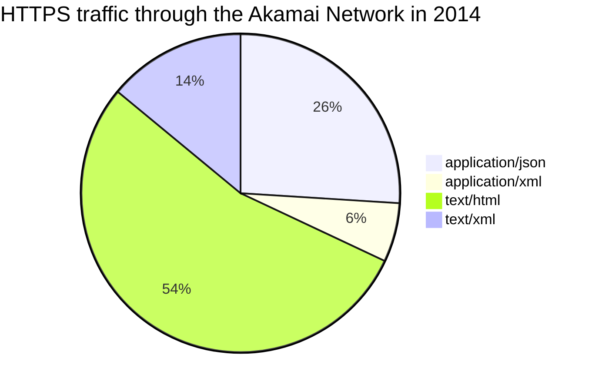
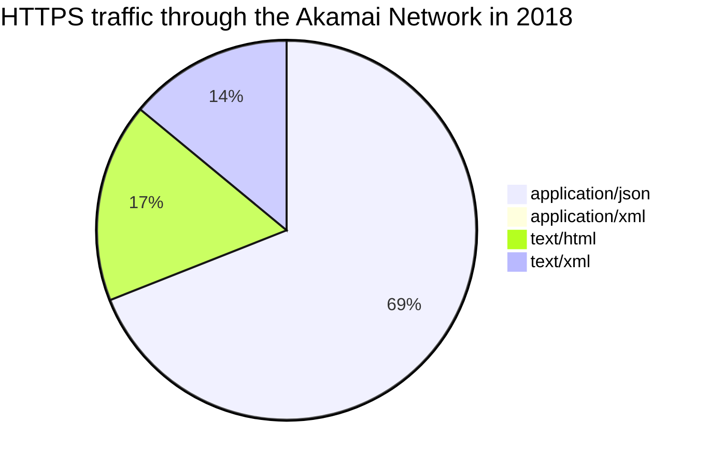

As the science-denial perpetrated omnishambles of 2020 continues, COVID-19 rages on whilst [Europe gets hit by deadly storms and flash floods](https://www.bbc.com/news/world-europe-54417223), [wildfires are big enough to be called "gigafires"](https://www.theguardian.com/us-news/2020/oct/06/california-wildfires-gigafire-first), [the Arctic refuses to freeze for the first time on record](https://www.msn.com/en-gb/news/uknews/alarm-as-arctic-sea-ice-not-yet-freezing-at-latest-date-on-record/ar-BB1ai0fd), [thousands are displaced by flooding in Vietnam](https://www.aljazeera.com/news/2020/10/11/deadly-floods-displace-thousands-in-cambodia-vietnam), and the only [countries on track to hit the Paris Agreement](https://climateactiontracker.org/countries/) are The Gambia and Morocco. 

Instead of hoping those in power decide to suddenly start listening to science and implementing solutions to solve the climate crisis, many of us are doing what we can to make change. For many of us in tech (or tech-adjacent roles), we can actually do quite a lot.

_[What Can a Technologist Do About Climate Change](http://worrydream.com/ClimateChange/)_ is a great essay written in 2015 by Bret Victor, but a lot has changed since then, and there are a plethora of new resources around. If you're on a mission to unfuck the climate a little bit, see if any of this can help you out.

## Identify the Solutions

Before we get into tech specific stuff, it's important to get a general handle on the problems and solutions. Depending on who you are this could be done in a few different ways.

Olivier Corradi, CEO of [Tomorrow](https://www.tmrow.com/) has written the excellent [Climate Change: a pragmatic guide](https://www.tmrow.com/climatechange/), and I'd strongly recommend it for a quick read to give you a firm grasp on several rather advanced concepts. It's data rich, backed with sources, and explains concepts like tCO2eq and emissions targets.

From there, [Project Drawdown](https://www.drawdown.org/) is a great next step. Even if you don't read the book, the [Table of Solutions](https://www.drawdown.org/solutions/table-of-solutions) helps identify which specific solutions can have the greatest effects and you can read up on what, why and how. It's rather academic at times and much of it will not be relevant to the average person, but "Carpooling" was what I was working on two jobs ago building Rails-based JSON APIs, and things like "Cement" might sound irrelevant until you learn there are folks out there building bluetooth enabled sensors to do {stuff I don't understand} which speeds up and reduces emissions and energy used in construction. Tech folks can help many sectors, and its interesting to know what the goals are in detail.

For something less academic, check out [How to Fix a Planet](https://gimletmedia.com/shows/howtosaveaplanet) for general climate action talk you can share with anyone, and [The Climate Fix](https://theclimatefix.com/) for a podcast focused on organizations and individuals working on solutions to parts of the problem, from cheap clean water, to smart-grid enabling electric cars.

[Climate Choice](https://climatechoice.co/) has some great guides, and I put together [Protect Earth](https://actions.protect.earth/) to help folks find resources with general climate action like zero-waste cleaning supplies, tips on how to rearrange your finances to de-fund fossil fuels, and everything in between, all around the world.

## Find Your Community

Just like anything in tech, there are meetups, conferences, and Slack channels where thousands of other interested people go to seek help, share advice, or just network with other individuals who share their interests. 

💬 [ClimateAction.Tech](https://climateaction.tech) - This Slack channel for folks working in tech, or for tech companies, or whatever nobody checks your ID, has almost 3,000 members. Channels include alternative energy vehicles, reforestation, jobs, online events, there are local channels for several countries and cities (what up Bristol!), and a channel for [Green Teams](https://www.triplepundit.com/story/2013/what-corporate-green-team-anyway/52531) to share notes.

👩‍🎨 [Climate Designers](https://www.climatedesigners.org/) - Good design is the most important part of any tech project, and these folks occasionally help out with pro-bono design work for climate projects.

🤖 [ClimateChange.AI](https://www.climatechange.ai/) - A bunch of AI volunteers from academia and industry, with a newsletter and a forum, discussing how they can use their skills to help. The Verge wrote a great overview: _[Here’s how AI can help fight climate change according to the field’s top thinkers](https://www.theverge.com/2019/6/25/18744034/ai-artificial-intelligence-ml-climate-change-fight-tackle)_. Extreme weather prediction, monitoring emissions and deforestation, and assisting the creation of new low-carbon materials, could all play a huge role in the process if deployed quickly and at scale.

🗣 [GreenTech South West](https://www.meetup.com/GreenTech-South-West/) - There's a lot of green tech meetups around so I won't list them all, but this one in South West Bristol has been consistently pushing amazing talks and events throughout all the nonsense this year. One of the organizers is [Hannah Smith](https://twitter.com/hanopcan/), who is well worth a follow to keep up with green tech.

## Green Jobs

In tech many of us have the privilege of above average incomes, and a disproportionate freedom of choice in where we work, even in the COVID-19 pandemic. This privilege can be wielded for the good of everyone else when it comes to contributing to climate solutions, but how is a discussion in itself. There are three common schools of thought.

- Work for charities and organizations who's core purpose is solving climate issues.
- Work for companies which have a big impact on the environment, and work from the inside to turn them around, as a Sustainability Software Engineer, or as part of a Green Team.
- Chase the biggest salary, regardless of what the company does, and give as much of it to climate projects as you can afford.

Green Tech has been exploding over the last few years, and salaries are pretty competitive. The idea that organizations benefiting the environment pay in peanuts and warm feelings is as untrue as it is pervasive. That said, you could certainly chase far bigger paychecks increasing clicks at a democracy subverting social media giant, or helping screw over contracted labour at a ride-share company. 

If you're chasing the big salary and screwing people/countries over, you're doing more harm than good, even if you donate 50% of your income. If you can work somewhere innocuous (I build software which [helps people design APIs](https://stoplight.io/)) and put some of that income towards environmental & social good, then that's a great way to go too. Direct or indirect support for the environment, so long as you first do no harm.

Something to keep in mind is that whilst getting a giant company like Microsoft, Shopify, Amazon, etc. to make better decisions is A Good Thing™️, but small and medium enterprises (SMEs) [make up 60% of CO2 emissions in Europe](https://op.europa.eu/en/publication-detail/-/publication/aa507ab8-1a2a-4bf1-86de-5a60d14a3977). As they often don't have the time or money to retrain, rewrite, or hire specific sustainable software engineers, you can help knock out a huge chunk of the CO2 by working on tech-based business information solutions that help businesses reduce their footprints. [Bloom](https://bloomclimate.com/) is a carbon footprint tracker doing this, using [open-source integrations](https://github.com/tmrowco/bloom-contrib/) with Uber, Trainline, TripIt, etc., so even if you don't want to [work for them](https://www.tmrow.com/jobs/), perhaps you could help them put a dent in those SME emissions through a few pull requests.

If you decide you'd like to have a browse around for jobs to see if there is anything that solves a problem you're interested in, has compensation you're happy with, and lets you work in a location you're happy working, then here's where you start looking.

The [ClimateAction.Tech](https://climateaction.tech) channel #d-job-opportunities is amazing for jobs, with several exciting opportunities posted there every day. It's a handy way to see incoming things in a feed, but if you want to go searching there's a lot of climate job sites out there.

[Climate Careers](https://climate.careers/) - Find high-impact, high-paying jobs at organizations advancing climate solutions, research, policy, education, and advocacy for climate action. Software engineers, photographers, sales, operations, researchers, all sorts of jobs here.

- [80,000 hours](https://80000hours.org/job-board/)
- [GoodWork.ca](https://www.goodwork.ca/)
- [GreenJobs.com](https://greenjobs.com/jobs/?q=remote&l=&r=200)
- [GreenJobsSearch.org](https://greenjobs.greenjobsearch.org/?s=remote)
- [ReconsideredJobs.co](https://jobs.reconsidered.co/jobs/?country=Remote)
- [TBD](https://www.tbd.community/)
- [Tech Jobs for Good](https://techjobsforgood.com/?q=&impact_areas=Environment&remote_jobs=on)

Happy hunting! 

## Automatic Integrations

Run a Shopify store? Enable the [Ecologi](https://apps.shopify.com/offset-earth) app so you can plant trees for every sale. 

Use Stripe? Contribute 1% of every transaction to the most effective carbon removal projects around with [Stripe Climate](https://stripe.com/climate).

## Green Tech APIs

Leveraging and integrating with these APIs can improve the products and services in various ways.

🌳💨 [Ecologi API](https://ecologi.com/) - British based company with an API businesses can use to purchase trees through charities like [Eden Reforestation Projects](https://edenprojects.org), or fund carbon reductions and sequestration through various [Gold Standard backed projects](https://ecologi.com/projects). 

👨‍💻💨 [Patch API](https://www.usepatch.com/) - Patch has a REST API with loads of plugins and SDKs for various languages. The goal here is to figure out how much carbon emissions are created by things like orders on a e-commerce platform, logistics, travel, or even for banks to figure out their customers footprints from purchases and help them offset it. Whatever you're up to, you can make micro-payments for tree planting, carbon reduction, or direct carbon capture.

🌍🔌 [electricityMap API](https://api.electricitymap.org/) - Electricity generation has a different "carbon intensity" in any given area, at any given time, depending on the mixture of sources of production. ElectricityMap from Tomorrow not only gives insight into which areas are producing and consuming which mixture of renewable or dirty energy, but it can provide 24 hour forecasts, meaning companies and smart-products can chose to do energy intensive tasks when energy is the cleanest. Electric Vehicles can charge at the best time, code deploys an batch jobs can be held until lowest (Google do this), devices can be powered by batteries instead of the grid during peak carbon intensity, all of which can save a bunch of money and reduce emissions.

🌍🔌 [co2signal](https://docs.co2signal.com/) - A free, non-commercial alternative to electricityMap also by Tomorrow. Use this to find out current carbon intensity and energy mixtures in various geographic locations. No access to the forecast or history.

🇬🇧🔌 [CarbonIntensity.org.uk](https://carbonintensity.org.uk/) - Same sort of thing covering the cleanliness of electricity but specifically for Brits. 

💯🌳 [DigitalHumani](https://digitalhumani.com/) - A "Reforestation as a Service" API for planting trees with zero fees taken, as it's entirely run by volunteers.

☁️💀 [OpenAQ](https://docs.openaq.org) - One in Eight deaths in the world is due to poor air quality, and these folks help track measurements all over the world. Find out what your air quality is, make your smart home shut the windows when it's terrible, or maybe decide to not go for a run if its deadly out.

🚘🔋 [Tom Tom Maps API](https://developer.tomtom.com/use-cases/ev-route-planning) - Speed up the transition to electric vehicles by creating routes which take range and charging requirements into account. 

🖥💨 [MyClimate Emission APIs](https://connect.myclimate.org/api-overview) - APIs for calculating emissions from driving, flights, cruise ships (please just don't go on cruise ships!), and for estimates of a whole company based on buildings, employee mobility, food, beverages, and supplies.

## Technical Decisions at Work

Some of those choices might involve getting the business and product people interested, or be side projects you work on with friends, but there are a lot of decisions that we make as technology people that are directly within our wheelhouse of technical decision making for the software and products we create.

> The carbon footprint of our gadgets, the internet and the systems supporting them account for about 3.7% of global greenhouse emissions, according to some estimates. It is similar to the amount produced by the airline industry globally, explains Mike Hazas, a researcher at Lancaster University. And these emissions are predicted to double by 2025.
> _-- **Source:** ["Why your internet habits are not as clean as you think", BBC Future](https://www.bbc.com/future/article/20200305-why-your-internet-habits-are-not-as-clean-as-you-think)_

Flying and Internet have a similar carbon footprint, and they're both growing at unmaintainable rates. If 3.7%% of emissions come from the Internet, and we need to half emissions to maintain a habitable planet not _double them_, how can we make better decisions at work to help?

### Carbon-Neutral Hosting

Traditional simple web hosting, VPS, managed WordPress, etc. can all be handled with [Eco Web Hosting](https://www.ecowebhosting.co.uk/), who are carbon neutral, [have an Ecologi forest](https://ecologi.com/ecowebhostinglimited), and list all of their [green credentials](https://www.ecowebhosting.co.uk/green-credentials) for folks to see what the "eco" part of the name actually means. 

When it comes to the major cloud providers: 

- 🟢 [Google Cloud: Sustainability](https://cloud.google.com/sustainability) - "We've matched 100% of our electricity consumption with renewable energy purchases since 2017, which includes the electricity to power Google Cloud. And we recently committed to fully decarbonize our electricity supply by 2030 and operate on clean energy, every hour and in every region." 

- 🟢 [Azure Sustainability](https://azure.microsoft.com/en-us/global-infrastructure/sustainability/) - "Azure, as a part of Microsoft, has been 100 percent carbon neutral since 2012. This means we are removing as much carbon each year as we emit, either by carbon removal (carbon offsetting) or reducing carbon emissions." They are currently offsetting essentially, and like Google have committed to 100 percent supply of renewable energy through the power purchase agreements (PPA). Other goals include: water positive by 2030 (replenish more water than they consume), zero-waste certification by 2030, and net-zero deforestation from new construction.

- 🟠 [Amazon AWS](https://sustainability.aboutamazon.com/environment/the-cloud) - "AWS purchases and retires environmental attributes, like Renewable Energy Credits and Guarantees of Origin, to cover the non-renewable energy we use in these regions: U.S. West (Oregon), GovCloud (U.S. West), Europe (Frankfurt), Canada (Central), Europe (Ireland)". That is only a handful of their data centers which have achieved carbon neutral through offsetting. The other clouds have already got to this step, and are working on increasing their renewable energy production to match demand. Amazon are building solar farms and other renewable energy sources like the other clouds, they're a long way behind Google Cloud and Azure.

Switching clouds is not a trivial task, and I'm not recommending flippantly switching for this reason alone when time could be spent on other reduction activities. If you've got enough people that this task can be handled relatively easily, and/or are considering a move anyway, try and push for Azure or Google Cloud. 

If you're running your own infrastructure, it's hugely likely that switching to one of the better clouds is going to be huge savings for you. They're focusing on making things more efficient full time, because every 1% they squeeze out of their operational efficiency is another 1% they don't have to pay to offset, or fund a new solar farm to cover. 

It's also worth noting, that just because you get on a "green cloud", that doesn't mean you can just use as much energy as you like. Regardless of if the host is matched by or powered by renewable energy, you still want to make your applications and infrastructures as efficient as possible. Why? Long story, well explained in _["Do you want to be powered-by renewables? The answer is no."](https://devblogs.microsoft.com/sustainable-software/do-you-want-to-be-powered-by-renewables-the-answer-is-no/)_ by [Asim Hussain](https://twitter.com/jawache).

### Sustainable Infrastructure

<!-- TODO Autoscaling back down to zero, not just to save money, but to reduce emissions.  -->

If you're using Kubernetes, there are some interesting ideas floating around about automatically [calculating emissions in various data centers and moving pods between multiple nodes to run your containers in the locations with lower carbon emissions. See _[Carbon Aware Kubernetes](https://devblogs.microsoft.com/sustainable-software/carbon-aware-kubernetes/)_ for an overview.

It takes a bit of planning, and there are various limitations like data sovereignty to keep in mind, but companies of a certain scale could put a large dent in their emissions this way, especially at SaaS companies or other organizations primarily running software.

### API Design

Ask anyone what the majority of traffic is on the Internet, they'll probably say "cute dogs" and "porn", but there's another answer: API traffic.

The most relevant data point we have here is about 83% of HTTPS traffic going through the Akamai network is JSON. Akamai [handle 15-30% of Internet traffic](https://www.akamai.com/us/en/resources/visualizing-akamai/real-time-web-monitor/real-time-web-metrics-methodology.jsp), and this statistic was published in their _[State of the Internet / Security: Volume 5, Issue 2 - Retail Attacks and API Traffic](https://www.akamai.com/us/en/multimedia/documents/state-of-the-internet/state-of-the-internet-security-retail-attacks-and-api-traffic-report-2019.pdf)_ report, which also gave these numbers. 

Great to see XML shrinking, that format is a little bulky. Some folks will suggest switching to BSON, Protobuf, or some other binary format, and that can help, but most of the time there's something a bit more important going on. You'd be amazed how often cacheability is overlooked, despite being listed as one of the main criteria of a REST API.

> Cacheability, a measurement of how much of the traffic can be saved on the servers used by content delivery networks such as Akamai, is comparable between HTML hits and API hits. While one-third of hits recorded were marked as “no-store,” and therefore preventing caching, the cache hit rate for API traffic was actually slightly higher than that of HTML traffic. **This means that a significant amount of the API traffic is being offloaded from the origin servers** of the customer and is being served from edge servers near the end user. **This significantly reduces the load on both the origin server and the Internet backbone as a whole.**

Emphasis added me, because this is awesome. I regularly have to help companies figure their way through [fixing up their ecosystem](https://phil.tech/2020/prioritizing-api-ecosystem-maturity/), and whilst some HackerNews mainlining muppets always push for ecosystem-wide rewrites in gRPC or Twirp chasing theoretical performance improvements, most of the time it turns out network caching was completely ignored. Whilst _Caching Should Not Be Used For Performance™️_, doing the same things over-and-over again ad-nauseam is not performant either.

Generally cache proxy servers like [Fastly](https://www.fastly.com/) offer a quick win right out of the box, reducing how often the origin server has to do the work of fetching data, and only needs a few HTTP headers added to make it work nicely. Then applying [HTTP caching middlewares to clients](https://apisyouwonthate.com/blog/speeding-up-apis-apps-smart-toasters-with-http-response-caching) can help the client not even bother making a request when it already knows the answer, or make [conditional requests](https://thoughtbot.com/blog/introduction-to-conditional-http-caching-with-rails) when it's not sure if the answer it has is still accurate.

Generally, when folks hear this they shout "it's not that simple, most API data is not cacheable!" Some folks will even say that API caching is inherently a bad idea... These people are fundamentally wrong, but it's really common. I've been trying to explain this for years. Giant payloads with all sorts of mixed data, with resource A, B, C, D all smushed into a single response body due to fear of "making too many calls" means you've got cacheable data mixed in with uncacheable data, therefore nothing is cacheable. 

This is some old HTTP/1 thinking, where ["compound documents" and GraphQL seem like a good idea](https://apisyouwonthate.com/blog/lets-stop-building-apis-around-a-network-hack), but has no place in a HTTP/2 world - especially with [HTTP/3 around the corner](https://www.fastly.com/blog/state-of-quic-and-http3-2020). 

Fastly wrote a great article showing how you can [design APIs to be more cacheable](https://www.fastly.com/blog/optimise-api-cache-improved-performance), and reduce the number of pointless requests hitting your API.

Again, with hosted cache proxy services focused on making things more efficient, you having a few cache servers is always going to be more efficient than having a bunch of origin servers, spreading them around all over the world, desperately waiting to try and answer redundant questions as quickly as they can.

Design more efficient APIs. Save the world. 👍

## Remote Work Post-Pandemic

Various surveys suggest that only 25% people are able to work from home, and most of us in tech fall into that group. Nobody should feel obliged to work from home, but everyone should support those who want to.

The list of companies offering some form of remote option as policy lasting after COVID-19 is growing rapidly: Atlassian, Basecamp, Coinbase, CircleCI, Facebook, Mailchimp, Netlify, Slack, Shopify, Square, Twitter, Stripe, Twilio, GitLab, GitHub, Zapier... 

_A more complete and up to date list can be found on this [handy tool from LifeShack](https://remote.lifeshack.io/)._

Whether it's flexible working, remote-friendly, remote-first, or fully distributed, tech companies are embracing "work from home", "remote work", "nomad lifestyles", etc., all of which facilitate decisions that can massively reduce greenhouse gas emission reductions. The most obvious being no longer being forced to drive/bus/train to work every day, but other things, like more control over food, waste, where your energy is coming from. Another thing to consider for those struggling with governments using their tax money to destroy the planet, is that remote work can let you move to countries which are actively working on climate solutions, like the Netherlands. 

I wrote about _[Remote Work as Climate Action](/2020/remote-working-climate/)_ if you'd like to learn more.

## Hack your Life

Thinking about energy efficiency and making smart technical decisions doesn't have to be limited to the day job. Use your tech skills to help set up smart-thermostats, smart-water boilers, or make dumb things smart. 

- [Ecobee](https://www.ecobee.com/en-us/smart-thermostats/#Overview) - Smart Thermostats that can apparently cut energy costs by 23%, but doing things like adjusting heating or cooling when electricity is cheaper and cleaner.
- [Sense](https://sense.com) - "Monitors your home's electric use to help you save money, see what’s on or off, and even avoid disaster."
- [Lancey](https://www.lancey.fr/) - "An efficient radiator to control your electricity consumption while improving comfort, with a connected thermostat to adapt to your needs and the characteristics of your home. A built-in battery stores electricity during off-peak hours, allowing you to automatically use cheaper and cleaner energy."
- [PowerX](https://www.powerx.co/) - "Uses machine learning to save you money on heating, pick apart individual devices that are on and off, and identify water use by outlet. Optimizing every heater in the world can save over 100 million tons of CO2 every year. Taking climate action can start from the boiler room."
- [Barry](https://barry.energy/) - "Barry is the 100% digital electricity supplier. With us, you can easily achieve smarter, cheaper and more climate-friendly energy consumption." (Denmark and France).

Generally the Internet of Things doesn't get me too excited, but when I noticed that many of these devices support [IFTTT](https://ifttt.com/), and both [electricityMap](https://ifttt.com/electricitymap) and [WattTime](https://ifttt.com/watttime) are also there, I started wondering what sort of amazing energy hacks can be made around the house. 

🏡 Make your blinds come down when it gets hot to bounce the sunlight out, instead of triggering the AC.

🔌 Get an notification from the IFTTT app letting you know that carbon intensity of the grid is low, so now is a good time to charge your laptop.

🔋 Inversely, find out when intensity is high so you can unplug your laptop to reduce the intensity a little. 

💉 Automatically have your Roomba pause when grid intensity is high, so it doesn't charge on coal power.

💡 Dim your lights when carbon intensity is high.

🚴‍♂️ Turn _everything off_ when carbon intensity is high, and go for walk/run/cycle/roll. 

_Bonus points if you get a [dynamo hub on your bike](https://www.cyclingabout.com/best-dynamo-hub-bicycle-touring-bikepacking/) and charge your phone off your legs instead of pestering the grid at all._

There's loads of interesting things a thoughtful smart-home could do to save energy if done appropriately, but sticking Bluetooth/WiFi in every single toaster and light bulb does have energy associated with it too. Track your energy usage and see what you can do to get it down, and when you've had success maybe look into helping your friends and family do the same at their homes too.

If none of that sounds interesting, maybe you like building physical things. What about making things out of home-recycled plastic?! [Precious Plastic](https://preciousplastic.com/) sell, and offer open-source designs for, [amazing machines](https://preciousplastic.com/solutions/machines/overview.html) that can turn plastic waste into pellets ready for melting down and using to build brand new things. Maybe you could make some useful things for gardening, home-improvement, phone cases, off-brand Lego, or whatever you think up. If you get good at it, maybe you could sell that stuff locally instead of people needing to buy cheap plastic junk from China. You can even register as a recycling center so people bring you the raw materials you need for your business.

## Improve Educational Resources

Continue to make [Climate Choice](https://climatechoice.co/)-like resources all around the world that help folks get it. Make one in Poland. Make one in Peru. Make them everywhere in ways that speak to people there, literally and culturally. Pair up with climate scientists and/or content writers, but help design and develop the sites that house that content. Ugly and poorly functioning resources get ignored, so pair up with designers who want to help the climate too. Sometimes you'll need to pay folks, and for that there's often companies who will sponsor your efforts. 

If you find yourself struggling for help or funding, [tweet at me](https://twitter.com/philsturgeon/) and I'll see what I can rustle up. I've got infinite retweets available for this sort of thing, and offer [free tech consulting for green tech projects](https://calendly.com/philsturgeon/climate). Again [ClimateAction.Tech](https://climateaction.tech) is a great place to find people to help your projects along.

## Collaboration and Utilization

Most of the solutions to address climate change already exist, and now we simply need to implement them. This can involve making them more accessible to the average person, which can mean easier to use, easier to understand, more visually appealing (which inherently makes the thing more trustworthy), or glueing things together to provide new value. 

We know that reforestation helps suck up CO2 and needs to happen at a much bigger scale, but amongst various problems, funding for reforestation is sparse and the charities who do take money have awful UI/UX. This is where [Ecologi](https://ecologi.com/) comes in! Taking Stripe and a monthly subscription model, they've built a kick-ass platform, and marketed the hell out of it, meaning more people are sending more money to those same charities than ever before. In the first year they've [filled up their dedicated planting area in Madagascar](https://ecologi.com/articles/updates/year-2-of-the-ecologi-forests), and have opened up three new planting locations! Add some donation buttons on profiles for fundraisers and people start promoting it for random stuff, like [cycling the height of the UK](https://ecologi.com/jonathanlane), or donating in the name of their [favourite PHP Framework](https://ecologi.com/laravel), and you've got a viral social aspect those charities didn't have before.

We know that cutting off money from [financial instructions supporting the fossil fuel industry](https://stopthemoneypipeline.com/) has a massive impact, so fintech projects like [Trine](https://www.trine.com/), [Climate8](https://www.crowdcube.com/companies/clim8), [Tree Card](https://www.treecard.org/), [Tomorrow](https://www.tomorrow.one/), [etc.](https://actions.protect.earth/finance/) are taking a swing at removing that money from the hands of people actively killing us, and putting it somewhere beneficial instead. This is being done by folks making websites and iPhone apps that focus on delivering value, instead of just finding more invasive ways to sell your data.

We know that [eating less meat and dairy](https://ourworldindata.org/environmental-impacts-of-food) can have a huge impact, but instead of just telling people that or shoving numbers in their face, apps like [No Meat Today](https://nomeat.today/) can help folks decide what they'd like to give up, and hold them to it in a fun and non-judgemental way, because it's an app and not a pushy friend of a friend telling you what to eat.

Taking existing tech and making it greener, and taking existing green ideas and leveraging tech to increase adoption: making them easier, more useable, more fun, and less academic, makes climate action generally more accessible to everyone. 

This is what we can do with our super power of "computering": for work, for play, and at home.

What is your first step going to be? 

<!-- training AI models created bonkers emissions https://www.technologyreview.com/2019/06/06/239031/training-a-single-ai-model-can-emit-as-much-carbon-as-five-cars-in-their-lifetimes/ -->
