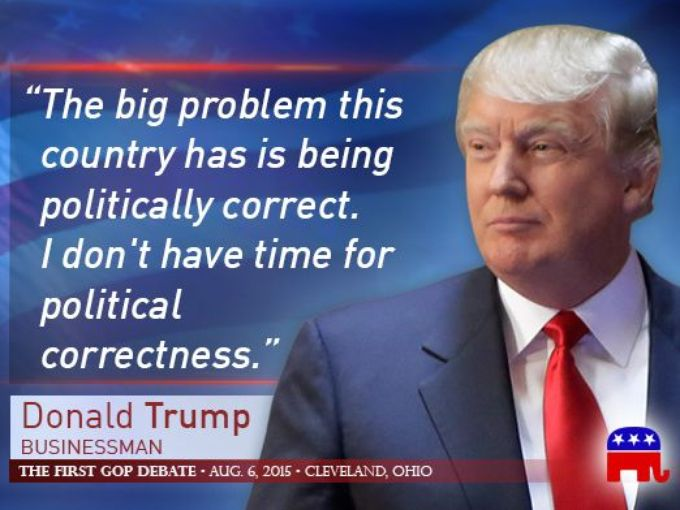
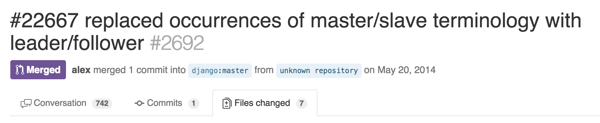
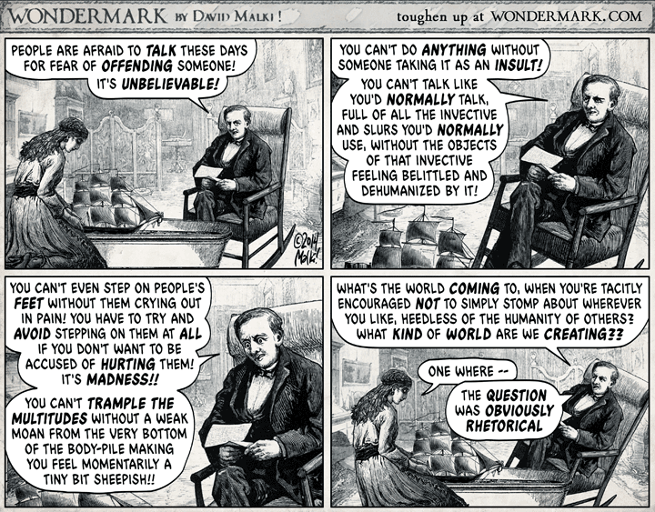

There have been about twenty articles I want to write about equality in tech, and they all end up crossing over into one big mess. I'm going to start unpicking these articles into a series, and I want to start by asking this question.

> Is everyone **really** offended?

Something I hear a lot, from friends, news articles, tweets from prominent tech community members and everywhere else, is that everyone is always outraged. The world has become too politically correct. That millennials are whiners who should be embarrassed. Compared to what our grandfathers were doing - defending Europe from the Nazis or fighting in Vietnam - the average person today is a pathetic keyboard warrior who needs to have their feels cuddled every day or they'll cry.

This perceived attitude is **bullshit**, and I would like to explain why.

Firstly, during times of drafted wars like those being mentioned: people fight and die, but in times of peace, people focus on improving whatever aspects of life they feel need to be improved. Obviously if you have armed enemy forces running around your streets (or those of an ally) then the priority will be to sort that out first. Without that, people focus on other things.

People try to improve the world in various small ways. For a while my way was to improve PHP's educational materials and provide standards, helping projects work together and younger developers waste less time. This empowers developers to build amazing things, and who knows, a few people might code their way out of poverty. I ended up joining the PHP-FIG, and eventually ended up just mediate fights between "leaders" in the PHP community. Playing jackass whisperer is a thankless task, and after lots of requests for me to give up I did. Now I'm trying to teach the internet about equality and feminism. What could go wrong.

The ways in which people choose to try and improve things will not always seem important to you, especially if it is not a problem you can identify with. It might be tiny, but representative of a larger problem you don't understand. If you have no experience in a problem, you may think it does not exist. You may consider the person to be exaggerating, or lying, or trying to jump on a bandwagon, or trying to impress people.

Even if you see a problem and are interested in learning about it, if it has not happened to you, who do you talk to see if they're valid?

Well, you probably end up talking to your friends. If they also haven't experienced these problems, then they're quite likely to just say "Sounds like nonsense to me." Especially if one of them happens to have seen it covered on the news, which also regularly plays into this same narrative of "people are always outraged!"

There is an incredibly interesting first hand account of somebody just having a little joke, and it turning into the the biggest OMFGPOCALYPE of the century. It is called [5 things the media does to manufacture outrage](https://medium.com/@parkermolloy/5-things-the-media-does-to-manufacture-outrage-ba79125e1262).

Give it a read! One person makes a joke and has a few retweets, some journalist picks it up on a slow news day because apparently Twitter is a source of news. Then other news sites repost it without thought because apparently shit news sites are a source of news. Then everyone jumps on the original person writing the jokes and screams at her to "get a fucking grip". She was never outraged. The people calling her a PC-nut are outraged. Then the news reports on that too.

These manufactured outrage stories happen not just from daft or lazy journalists looking to fill some time, but sometimes by malicious people. These could be journalists looking to push a particular political narrative, or it could be assholes like 4chan making up a fake aggressive man-hating feminism article to make the average person think "Wow, feminists are nuts."

Either way, **you're being duped**. You see enough of these nonsense stories, you hear enough of your friends saying "Everyones offended these days" and eventually - through no fault of your own - you're more likely to think that's whats happening the next time.

These causes can be anything from harassment at the workplace, how valuable a code of conduct can be to women at a conference, how redefining rape to mean "I didn't say yes I just fell asleep" is important, how "religious freedom" rules legalizing and ratifying homophobia is not ok, what names communities like (and really do not like) to be called, if running a massive advertising campaign at Spotify saying "So easy you Mum could do it" and "No mum not that cloud" is offensive to mothers in general - regardless of how tech your mum might be, etc.

Some of those situations are _clearly_ not as severe as others, but they're all treated on the same polar scale. The people who think the whole world is sensitive put every one of these issues on a scale from 0 to 1, where 1 is "I agree this is a problem" and 0 which is "Whiny liberal".

I've many times pointed out how something is not ideal or a bit daft, then these people argue it forever. When I get frustrated with the circular bullshit arguments they're using to #NahItsFine me, they say I'm overreacting. If they'd put "Not ideal" and "I would like to know more" on their scale, along with "I disagree with that person but they could well be an extremist", then the world would be a far far better place.

Sadly, people who are either malicious, or have been duped by the propagation of thus "Everyone is outraged" nonsense, will take any moderate view put out there by somebody else and see which end of their 0-1 scale it lands. If that results in 0 they'll spout a pile of bullshit at you and anything you do to try and counter it goes basically nowhere.

Don't get me wrong, there _are_ some pretty daft things coming from people who I consider to be extremist in the politically correct debate. For example: my mother - as a teacher of young children in the UK - was forced to sing "Bah Bah Rainbow Sheep" with the kids, instead of "Bah Bah Black Sheep"...

I personally think that's fairly silly, because some sheep are legitimately black, but I'm sure there were plenty of cases of black kids getting bullied for being "the odd one out" in that sense. That may or may not be something you think of or care about and IMO kids will bully each other about something regardless. Most kids are awful people and we can't save them from that, but I'm certainly not gonna pick a fight over the name of that song especially without knowing more.

Parents as a group have some pretty varied views on things, but - in the USA especially - a lot of what you hear coming from them are unnecessary screams of "WONT SOMEBODY PROTECT THE CHILDREN". These then get mixed in with other progressives, and we end up in a "Everyones a winner" mollycoddled society. I'm not a fan of that, and I used to lose all the time at everything at school. Luckily things are not all moving in that direction, and the USA is [once again letting children walk home from school](http://nypost.com/2015/12/16/your-kids-can-walk-to-school-alone-again/) by themselves without the parents getting arrested. Well done.

The main problem for me here is this: People who are otherwise logical, intelligent people, will very quickly say things like "But everything is sexist, homophobic or racist these days!" purely because they're believing this narrative. They won't evaluate specific situations, research for more information or try to gain any understanding before flapping their mouth all over the place, instead they just lean on their phrases like "Some people are spring-loaded to offended" and assume that every single topic is invalid.

That's the definition of ignorance. Right?

Let's look at the ["master/slave" nonsense](https://github.com/django/django/pull/2692) that the [Django Framework](https://www.djangoproject.com/) suffered through.

I personally would not have thought of this. I probably would not have fought for it myself. That - as mentioned above - does not make it invalid. That is probably because it does not affect me, but it does affect plenty of people, and some who you might not even think of at first:

> Thanks as a DevOP, I've always had to endure BS snickering and jokes about being a dominatrix when trying to have a civil conversation about databases. Maybe there's hope this will change globally. And I much prefer primary/replica to the leader/follower, too, since that's a more technical pair that will be more easily understood....without the BS about being a dominatrix. :)

That seems pretty fair, right? I'd be annoyed about that. Hell, I get annoyed when people mistake me for being Australian or make Harry Potter jokes so having random muppets making shit jokes about being a dominatrix would probably really grind my gears.

The pull request was a single commit, touching seven files and (including the test suite) changed only 81 lines of code. The PR was merged in the same day it was created.

Then a shitload of white-dudes flew in to #WellActually and #NahItsFine the situation.

> This is silly.
> Next we will remove all mention og objects because some people might feel objectified.
> Or classes, because of the poor people that feels they are being discriminated against.

People who are against change like to use ridiculous slippery slopes to make it look like they have a valid point. This is used _all the time_ in the news. "Well if we allow gay marriage, next we'll be legalising bestiality!"

If your point does not stand without needing to get a waterpark of slippery slopes involved, you might not actually have a point.

> Is Leader/Follower a dig at victims of cults?

Smartarsing hard.

> "Are you serious? ... In this case, master/slave is used by every database server..."

Not true, as somebody else points out: "DB2 doesn't use master-slave, it uses primary-standby and occasionally replica. And it's been that way for quite a few years now, so it's by definition not universal, just widespread."

If you're going to #WellActually please at least do it properly.

> Completely and utterly pointless.

Completely and utterly pointless [to you]. See entire post above.

> Don't feed the trolls, and just continue to use master and slave.

Well, looking through this thread, there are a lot of people on the pro side offering sentiments of "Cheers" and "Ahh yeah that was a bit annoying", whilst the against are flipping their collective shits over it and calling everyone names.

If you want to say "I'm not sure about leader/follower, how about primary/secondary or primary/replica" then awesome; that is a constructive conversation, but running in from the wings to shout at people and use "politically correct" as an insult... well it doesn't make you a great person.

So, instead of freaking out about problems you don't understand, assuming everyone is just being overly sensitive, being absolutely awful to under-represented groups when they point out reasons they feel uncomfortable in the tech community, then having the gall to suggest there are far fewer of these people in the tech community because they aren't as interested in tech... maybe take a few steps back and think about that whole situation.

Think really hard.

Think really _really_ hard.

This post has a lot of relevance to the Code of Conduct conversation happening in the PHP community right now. I've got a lot more thoughts on that to come.

Do me a favour and smash this onto your Twitter feed so we can try to turn a few heads with a bit of sanity and logic.
